# CLM-Bench: Benchmarking and Analyzing Cross-lingual Misalignment of LLMs in Knowledge Editing

Yucheng Hu $^{1}$  Wei Zhou $^{1}$  Juesi Xiao $^{2}$

$^{1}$ Tianjin University, School of Future Technology  $^{2}$ Tianjin University, College of Intelligence and Computing

yc_h666@tju.edu.cn

# Abstract

Knowledge Editing (KE) has emerged as a promising paradigm for updating facts in Large Language Models (LLMs) without retraining. However, progress in Multilingual Knowledge Editing (MKE) is currently hindered by biased evaluation frameworks. We observe that existing MKE benchmarks are typically constructed by mechanically translating English-centric datasets into target languages (e.g., English-to-Chinese). This approach introduces translation artifacts and neglects culturally specific entities native to the target language, failing to reflect the true knowledge distribution of LLMs. To address this, we propose CLM-Bench, a culture-aware benchmark constructed using a native Chinese-first methodology. Unlike previous works, we curate 1,010 high-quality CounterFact pairs rooted in Chinese cultural contexts (covering domains like history and literature) and subsequently align them with English counterparts. Using CLM-Bench, we conduct extensive experiments on representative LLMs (e.g., Llama-3, Qwen2) and reveal a significant Cross-lingual Misalignment: edits in one language function independently and fail to propagate to the other. We further provide a geometric explanation via layer-wise representation analysis, demonstrating that edit vectors for Chinese and English are nearly orthogonal—residing in disjoint subspaces—while mixed-lingual editing exhibits perfect linear additivity of these vectors. Our findings challenge the effectiveness of current methods in cross-lingual transfer and underscore the importance of culturally native benchmarks. $^{1}$

# 1 Introduction

Large Language Models (LLMs) have demonstrated remarkable abilities in memorizing and utilizing world knowledge (Chang et al., 2024;


Figure 1: This figure illustrates Chinese-English editing independence: Applying the same edit with different target values yields different Chinese and English outputs.

Ouyang et al., 2022). However, a fundamental limitation persists: the parametric knowledge within these models is static. As the world evolves, the facts stored in LLMs become outdated or incorrect (Chen et al., 2024; Wang et al., 2024f; Tang et al., 2025). To address this, Knowledge Editing (KE) has emerged as a promising paradigm, with the aim of precisely modifying specific facts in a model without the prohibitive cost of retraining or the degradation of catastrophic forgetting (Gupta et al., 2024; Wang et al., 2024e).

Although current KE methods, such as ROME (Meng et al., 2022a) and Wise (Wang et al., 2024d), have achieved high reliability in monolingual settings (primarily English), they largely overlook a critical dimension of reality in multilinguality. As LLMs are increasingly deployed in crosslingual scenarios (Wang et al., 2024a; Doddapaneni et al., 2025), a successful edit should ideally propagate across languages. For instance, updating the "Prime Minister of the UK" in English should spontaneously correct the corresponding knowledge when queried in Chinese. However, recent studies in Multilingual Knowledge Editing (MKE)

---

suggest that cross-lingual transfer is far from trivial *Wang et al. (2024b); Raheja et al. (2024)*.

We identify several limitations in current multilingual knowledge editing research that motivate our work. First, existing benchmarks are mainly based on translated datasets. Most MKE datasets, such as ZsRE *Wang et al. (2024b)*, are constructed by translating English datasets into other languages, introducing "translationese artifacts" and disconnecting from culturally native entities (e.g., Chinese idioms or local celebrities) *Liu et al. (2025)*. Second, and more critically, the underlying mechanism of cross-lingual misalignment remains unexplained. While previous work observes that editing one language often fails to transfer to another, the geometric relationship between language-specific representations has not been rigorously analyzed *Kargaran et al. (2025)*.

To bridge these gaps, we propose CLM-Bench (Cross-Lingual Misalignment Benchmark), a comprehensive framework designed to evaluate and analyze the alignment of knowledge editing across languages. Unlike previous works, we construct a native Chinese-first CounterFact dataset consisting of 1,010 high-quality pairs across diverse domains (History, Literature, Science, etc.), which are then aligned with English counterparts. This ensures that the evaluation reflects genuine native language understanding rather than translation artifacts. Using CLM-Bench, we conduct extensive experiments on representative LLMs (e.g., Llama-3, Qwen2) using state-of-the-art editing methods. Our empirical results reveal a significant phenomenon of Cross-lingual misalignment as shown in Figure 1: the independence and linear additivity of Chinese and English edits

Further, we provide a geometric explanation for this misalignment via layer-wise representation analysis. By probing the hidden states at deeper layers, we discover two critical geometric properties of editing vectors: (1) The edit vectors for Chinese and English representations are nearly orthogonal. This explains why cross-lingual transfer fails—the optimization direction for one language has almost no projection onto the other. (2) Moreover, the resulting vector is an almost perfect linear sum of the individual language vectors when we perform mixed-language editing. This insight suggests that multilingual knowledge in current LLMs is stored in disjoint subspaces that do not naturally interact during gradient-based or locate-and-edit updates, challenging the “interlingua" hypothesis in the context of parameter editing. Overall, our contributions are as follows:

- We introduce CLM-Bench, a culture-aware and counterfact benchmark for evaluating cross-lingual knowledge editing, overcoming the limitations of translation-based datasets.
- We provide a systematic evaluation of current editing methods, uncovering the asymmetry and independence of editing effects between Chinese and English.
- We offer a novel geometric interpretation based on vector orthogonality and linearity, providing an experimental foundation for why current methods fail in cross-lingual transfer and how mixed-editing strategies succeed.

## 2 Related Work

### 2.1 Knowledge Editing Methods

Knowledge editing approaches include: Meta-learning methods such as MEND *Mitchell et al. (2022a)*, which learnEACL editing rules from data; Memory-augmented methods such as SERAC *Mitchell et al. (2022b)*, which store edits externally; Locate-and-edit methods, now the most effective for persistent edits. Among locate-and-edit approaches: ROME *Meng et al. (2022a)* performs rank-one updates to targeted MLP layers; MEMIT *Meng et al. (2022b)* extends this to multi-fact batch editing; AlphaEdit *Fang et al. (2024)* introduces a null-space constraint to reduce interference; PMET *Li et al. (2024)* refines Transformer parameter transformations for more precise edits.

While effective in monolingual (mainly English) settings, their cross-lingual behavior remains understudied*Durrani et al. (2025)*.

### 2.2 Knowledge Editing Datasets

Most existing knowledge editing benchmarks are monolingual and predominantly English. CounterFact *Meng et al. (2022a)* and ZsRE *Levy et al. (2017)* are the most widely used datasets, providing factual triples and counterfactual queries for evaluating locality, specificity, and generalization of edits. To move beyond English, recent work has introduced multilingual variants. Bi-ZsRE *Wang et al. (2024b)* extends ZsRE to Chinese–English pairs, enabling bilingual consistency evaluation. *Beniwal et al. (2024)* further investigate multilingual editing across diverse scripts (e.g., Latin, Indic) using

---

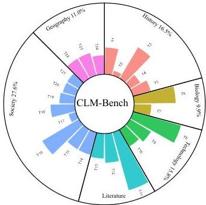
Figure 2: Overview of CLM-Bench, covering 6 subdomains and 24 domains.

T1 Ancient Chinese History

T2 Modern Chinese History

T3 Modern History of the World

T4 English History

T5 American History

T6 Animals

T7 Plants

T8 Basic Sciences

T9 Technological Invention

T10 Agriculture

T11 Chinese Literature

T12 Foreign Literature

T13 Greek Mythology

T14 Culture and Folk Customs

T15 Political System

T16 Celebrities

T17 Economy

T18 Careers

T19 Sports

T20 Cuisine

T21 Elite Schools

T22 Physical Geography

T23 Architecture

T24 Transportation

mBERT and XLM-RoBERTa, highlighting crosslingual challenges not captured by monolingual benchmarks.

However, translation-based datasets exhibit known limitations. For multilingual NLP benchmarks, studies such as (Liu et al., 2025) show that translation may introduce "translationese" artifacts and distort cultural/language nuances, reducing linguistic naturalness. They also rarely include language-specific entities or relations that stress-test multilingual factual grounding. Consequently, such limitations may obscure cross-lingual failure modes in knowledge-editing evaluations and motivate the development of culturally grounded multilingual benchmarks.

# 3 CLM-Bench

# 3.1 Data Construction Pipeline

The construction of CLM-Bench mainly consists of three components: Data Source, Generation Methodology, and Post-processing. More details can be found in Appendix A.

# 3.1.1 Data Sources

The data sources for this dataset are primarily divided into two categories: (a) LLM-assisted Generation. We utilized the Deepseek-R1 large lan

guage model as the core tool to generate the original content. (b) Open-source Datasets. Our research incorporated partial data from the open-source dataset ZsRE(Levy et al., 2017) and CounterFact(Meng et al., 2022a)

# 3.1.2 Generation Methodology

Our generation methodology consists of the following steps: (a) Data Design. We designed a structured data format and established specific linguistic guidelines for each core field. Each entry contains the following core fields: prompt, target_new, groundtruth, subject, and rephrase_prompt. (b) Knowledge Categorization. To ensure the generated data is not concentrated in a single domain, we categorized the intended data into 24 distinct knowledge domains and crafted specific prompts for the LLM accordingly. (c) Model Generation. We used the Deepseek-R1 LLM to assist in data generation. Initial content and its corresponding English version were produced using manually designed prompts. Approximately 1,100 raw data entries were generated through multi-turn dialogues. (d) Merging. We extracted the loc and loc_ans sections from the open-source dataset and merged them with our generated data to complete the construction of the full dataset.

---

3.1.3 Post-processing

To ensure data quality, we implemented the following post-processing steps: (a) Deduplication. Manual deduplication was performed on the approximately 1,100 entries, removing samples with duplicate prompt and subject fields. (b) Quality Review. Reviewers ensured the ground_truth was accurate, the target_new was an incorrect answer forming a clear contrast with the ground truth. Simultaneously, the English versions of the data were manually reviewed to guarantee grammatical correctness, linguistic fluency, naturalness, and compliance with format requirements. (c) Standardization. All data was uniformly formatted using the JSON standard.

### 3.2 Dataset Statistics and Quality

Figure 2 presents the statistical overview of our dataset. The final dataset comprises 1,010 high-quality entries, covering 24 different knowledge domains to ensure comprehensive evaluation. Chinese Literature constitutes the largest portion at 10.1%, while Modern Chinese History accounts for the smallest portion at 0.8%.

Our dataset holds advantages over traditional translated datasets in terms of entity coverage and language naturalness: (a) Entity Coverage. Traditional translated datasets are often built by directly translating an English benchmark into the target language. Consequently, the entities they contain exhibit a strong bias towards English. For instance, they may include numerous obscure foreign personal and place names while severely lacking entities important in Chinese. Our dataset carefully selects entities significant in both Chinese and English contexts for data construction, ensuring balanced entity coverage. (b) Language Naturalness. Traditional translated datasets inevitably suffer from translation errors, leading to rigid, unnatural expressions that poorly reflect the authentic usage patterns of native speakers. Our dataset employs Deepseek-R1 for initial translation, followed by manual review and editing, ensuring fluency and naturalness in both languages.

## 4 Experimental details

### 4.1 Experimental Settings

We evaluate cross-lingual and mixed-lingual knowledge editing across four large language models with distinct linguistic training profiles: two with substantial Chinese corpora—Llama2-7B Chinese, which was incrementally pre-trained on large-scale Chinese data to improve foundational semantic understanding *Touvron et al. (2023)*, and Qwen2-7B *Yang et al. (2024)*—and two primarily English-dominant models, Llama3-8B *Grattafiori et al. (2024)* and Mistral-7B *Jiang et al. (2023)*. This selection allows us to compare editing behaviors across multilingual, Chinese-oriented, and English-oriented architectures.

Because our work focuses on batch-mode model editing, where all target facts are injected into the model in a single editing pass with persistent, lifelong effects, our method primarily considers the three state-of-the-art batch editing approaches: MEMIT *Meng et al. (2023)*, AlphaEdit *Fang et al. (2024)*, and PMET *Li et al. (2024)*.MEMIT performs large-scale batch editing by directly computing parameter updates, enabling injection of thousands of facts at once. AlphaEdit adds a null-space constraint, projecting updates into the null space of preserved knowledge to reduce interference and improve stability during sequential edits. PMET refines parameter transformations in Transformer models to achieve more precise and controlled batch edits. All algorithms are implemented using the EasyEdit framework *Wang et al. (2023)*.

Our primary experiments use a batch of 1000 edits in each monolingual setting (Chinese-only and English-only). To further examine multilingual interactions, we introduce a mixed-lingual editing setup consisting of 2000 bilingual edit triplets, where each fact is injected simultaneously using both a Chinese and an English trigger. This setup probes whether editing jointly in two languages improves or compromises cross-lingual consistency. Additional ablations are performed on Llama3-8B using MEMIT to assess: (1) scale sensitivity with smaller batch sizes, and (2) layer-specific effects by editing different MLP layers. Similar layer ablations are also conducted on Qwen2-7B to verify consistency across model architectures. All evaluations are conducted in a lifelong (sequential) editing protocol, where previous edits remain active.

### 4.2 Evaluation Metrics

Following standard practice in knowledge editing *Meng et al. (2022a, 2023); Müller et al. (2023)*, we evaluate edited models using eight metrics grouped into four dimensions, plus a cross-lingual transfer score.

---

Table 1: Model Editing Evaluation Results. The results show that Chinese editing accuracy is approximately equal to mixed editing accuracy in Chinese, and English editing accuracy is approximately equal to mixed editing accuracy in English.

|  Model | Methods | Editing Language | zh score | en score | zh |   |   | en |   |   | trans  |
| --- | --- | --- | --- | --- | --- | --- | --- | --- | --- | --- | --- |
|   |   |   |   |   |  Reliability | Generality | Locality | Reliability | Generality | Locality  |   |
|  Llama3-8B | MEMIT | Chinese | 61.71% | 43.44% | 63.21% | 56.74% | 65.17% | 19.55% | 18.69% | 92.09% | 30.93%  |
|   |   |  English | 59.33% | 68.31% | 44.42% | 44.91% | 88.67% | 75.47% | 39.08% | 90.37% | 58.86%  |
|   |   |  mix | 61.24% | 66.83% | 63.21% | 57.07% | 63.43% | 72.73% | 38.89% | 88.86% | 86.91%  |
|   |  AlphaEdit | Chinese | 1.84% | 4.04% | 1.85% | 1.49% | 2.19% | 4.12% | 3.97% | 4.03% | 44.90%  |
|   |   |  English | 15.96% | 38.00% | 14.79% | 13.90% | 19.20% | 64.98% | 36.53% | 12.50% | 22.76%  |
|   |   |  mix | 1.54% | 11.38% | 1.05% | 1.36% | 2.20% | 19.58% | 9.24% | 5.33% | 5.36%  |
|   |  PMET | Chinese | 51.17% | 44.35% | 41.83% | 41.46% | 70.23% | 19.50% | 18.09% | 95.45% | 46.62%  |
|   |   |  English | 58.48% | 42.54% | 43.15% | 43.14% | 89.16% | 19.60% | 18.99% | 89.03% | 45.42%  |
|   |   |  mix | 53.18% | 42.36% | 43.18% | 42.92% | 73.45% | 19.94% | 19.54% | 87.61% | 46.18%  |
|  Mistral-7B | MEMIT | Chinese | 8.62% | 46.76% | 6.99% | 6.69% | 12.18% | 27.35% | 27.36% | 85.56% | 25.56%  |
|   |   |  English | 40.56% | 58.96% | 33.85% | 32.71% | 55.12% | 57.74% | 45.13% | 74.02% | 58.62%  |
|   |   |  mix | 7.57% | 55.81% | 6.73% | 5.99% | 9.99% | 55.39% | 43.43% | 68.60% | 12.15%  |
|   |  AlphaEdit | Chinese | 14.25% | 44.25% | 14.30% | 13.18% | 15.26% | 26.76% | 25.99% | 80.01% | 53.44%  |
|   |   |  English | 34.96% | 41.12% | 33.96% | 33.64% | 37.27% | 43.58% | 35.65% | 44.13% | 77.93%  |
|   |   |  mix | 11.53% | 40.64% | 13.00% | 11.33% | 10.26% | 43.29% | 35.72% | 42.90% | 30.03%  |
|   |  PMET | Chinese | 8.96% | 2.83% | 13.02% | 12.91% | 0.96% | 1.32% | 0.93% | 6.23% | 10.14%  |
|   |   |  English | 7.04% | 16.09% | 5.73% | 5.48% | 9.92% | 21.01% | 15.16% | 12.09% | 27.27%  |
|   |   |  mix | 10.70% | 15.16% | 15.53% | 15.74% | 0.83% | 20.95% | 13.10% | 11.43% | 74.13%  |
|  Qwen2-7B | MEMIT | Chinese | 58.56% | 38.46% | 67.56% | 59.81% | 48.32% | 22.36% | 21.21% | 71.82% | 33.10%  |
|   |   |  English | 52.43% | 69.29% | 46.60% | 45.61% | 65.08% | 80.69% | 57.72% | 69.45% | 57.75%  |
|   |   |  mix | 55.08% | 67.38% | 63.92% | 57.13% | 44.20% | 82.13% | 58.56% | 61.45% | 77.83%  |
|   |  AlphaEdit | Chinese | 14.87% | 17.84% | 16.91% | 13.94% | 13.75% | 17.02% | 16.39% | 20.10% | 99.35%  |
|   |   |  English | 38.53% | 57.51% | 38.31% | 37.46% | 38.82% | 75.77% | 58.99% | 37.77% | 50.56%  |
|   |   |  mix | 8.83% | 35.56% | 10.23% | 7.69% | 8.57% | 54.08% | 40.27% | 12.32% | 18.92%  |
|   |  PMET | Chinese | 0.77% | 15.92% | 0.07% | 0.03% | 2.20% | 14.98% | 12.42% | 20.37% | 0.47%  |
|   |   |  English | 0.50% | 1.02% | 0.27% | 0.15% | 1.08% | 0.48% | 0.32% | 2.27% | 56.25%  |
|   |   |  mix | 0.52% | 0.73% | 0.17% | 0.40% | 1.00% | 0.21% | 0.31% | 1.66% | 80.95%  |
|  llama2-chinese-7B | MEMIT | Chinese | 13.84% | 47.92% | 13.23% | 12.07% | 16.21% | 30.27% | 30.19% | 83.31% | 43.71%  |
|   |   |  English | 50.05% | 68.72% | 39.79% | 39.41% | 70.96% | 71.42% | 59.41% | 75.32% | 55.71%  |
|   |   |  mix | 14.05% | 65.29% | 14.06% | 12.81% | 15.28% | 69.97% | 57.41% | 68.50% | 20.09%  |
|   |  AlphaEdit | Chinese | 8.64% | 25.85% | 9.54% | 8.60% | 7.78% | 19.15% | 18.80% | 39.60% | 49.82%  |
|   |   |  English | 21.46% | 29.04% | 15.31% | 15.30% | 33.77% | 34.07% | 27.53% | 25.52% | 44.94%  |
|   |   |  mix | 9.45% | 20.01% | 11.52% | 10.50% | 6.33% | 26.27% | 19.23% | 14.52% | 43.85%  |
|   |  PMET | Chinese | 50.76% | 51.50% | 37.64% | 37.25% | 77.40% | 29.46% | 29.39% | 95.66% | 78.27%  |
|   |   |  English | 60.22% | 51.39% | 43.06% | 42.66% | 94.93% | 30.00% | 29.85% | 94.33% | 69.67%  |
|   |   |  mix | 51.38% | 50.88% | 38.13% | 37.76% | 78.24% | 30.22% | 29.82% | 92.60% | 79.26%  |

Basic Performance. zh_score and en_score represent the overall editing performance for Chinese and English queries, respectively. Each score is computed as the average of the three core editing criteria: locality, reliability, and generality.

Reliability. Reliability measures the success rate of edits in both Chinese and English. It is computed by comparing the model's predicted tokens against the ground-truth answers and calculating the corresponding accuracy.

Generality. Generality assesses the model's ability to generalize an edit across paraphrased queries. Specifically, it evaluates whether the edited model can correctly answer rephrased versions of the original questions. The accuracy is computed using the same procedure as in reliability.

Locality. Locality quantifies the preservation of unrelated knowledge. It is defined as the accuracy on unrelated queries and is measured by the similarity between the model's responses before and after editing for the same control questions.

Cross-lingual Transfer. Cross-lingual transfer evaluates the alignment between Chinese and English editing performance. It is measured by comparing the accuracy of edits applied in Chinese with the accuracy of the corresponding edits applied in English.

# 5 Experimental Results

# 5.1 The Misalignment Phenomenon

Our experimental results confirm the misalignment between knowledge editing success and multilingual generation capabilities previously observed in BiZsre(Wang et al., 2024c) and related studies. As

---

Table 2: Model Editing Evaluation Results in different batchsize

|  Model | Batch size | Methods | Editing Language | zh score | en score | zh |   |   | en |   |   | trans  |
| --- | --- | --- | --- | --- | --- | --- | --- | --- | --- | --- | --- | --- |
|   |   |   |   |   |   |  Reliability | Generality | Locality | Reliability | Generality | Locality  |   |
|  Llama3-8B | 1 | MEMIT | Chinese | 86.67% | 44.44% | 80.00% | 80.00% | 100.00% | 33.33% | 0.00% | 100.00% | 41.66%  |
|   |   |   |  English | 60.00% | 66.67% | 40.00% | 40.00% | 100.00% | 100.00% | 0.00% | 100.00% | 40.00%  |
|   |   |   |  mix | 88.89% | 66.67% | 100.00% | 100.00% | 66.67% | 100.00% | 0.00% | 100.00% | 100.00%  |
|   |  10 | MEMIT | Chinese | 75.83% | 43.45% | 73.00% | 64.33% | 90.16% | 21.00% | 12.67% | 96.67% | 28.77%  |
|   |   |   |  English | 59.70% | 71.23% | 43.44% | 38.17% | 97.50% | 80.00% | 37.67% | 96.03% | 54.30%  |
|   |   |   |  mix | 89.77% | 73.00% | 94.17% | 88.83% | 86.31% | 87.50% | 31.50% | 100.00% | 92.92%  |
|   |  100 | MEMIT | Chinese | 71.87% | 43.93% | 74.41% | 63.24% | 77.96% | 18.80% | 16.10% | 96.88% | 25.27%  |
|   |   |   |  English | 60.93% | 71.34% | 42.95% | 42.53% | 97.33% | 82.83% | 36.06% | 95.14% | 51.83%  |
|   |   |   |  mix | 74.50% | 71.62% | 77.20% | 66.45% | 79.85% | 80.25% | 37.32% | 97.29% | 96.20%  |
|   |  1000 | MEMIT | Chinese | 61.71% | 43.44% | 63.21% | 56.74% | 65.17% | 19.55% | 18.69% | 92.09% | 30.93%  |
|   |   |   |  English | 59.33% | 68.31% | 44.42% | 44.91% | 88.67% | 75.47% | 39.08% | 90.37% | 58.86%  |
|   |   |   |  mix | 61.24% | 66.83% | 63.21% | 57.07% | 63.43% | 72.73% | 38.89% | 88.86% | 86.91%  |

shown in Table1, the models exhibit a consistent trade-off: Misalignment between Chinese and English edits.

This pattern is most evident in llama3-8B with MEMIT at batch size 1000. Chinese editing achieves zh_score of  $61.71\%$  with strong zh_Reliability at  $63.21\%$ , yet en_reliability collapses to  $19.55\%$ . This indicates that while the model can recall edited facts, it struggles to generate fluent English text and fails to maintain consistency with English knowledge.

Similarly, as shown in Table2, we conducted experiments with MEMIT on llama3-8B across different batch sizes, where the misalignment phenomenon is particularly pronounced. On the trans metric, both monolingual Chinese editing and English editing consistently exhibit relatively low values. Moreover, Table 3 shows that editing different MLP layers does not substantially alter this pattern—the cross-lingual misalignment persists across all layer choices, confirming it is a fundamental property of the editing mechanism rather than an artifact of layer selection.

Critically, at batch size 1000, AlphaEdit and PMET may exhibit catastrophic forgetting, with generation metrics falling below  $20\%$  across multiple language conditions. This suggests that certain editing algorithms fundamentally compromise multilingual capabilities when applied at scale, representing a practical limitation of current knowledge editing approaches.

# 5.2 The Linear Effect of Mixed Editing

Mixed-language editing results in an approximately linear combination of the monolingual extremes across all configurations. In other words, the Chinese metrics from Chinese editing and the English metrics from English editing roughly sum to the

corresponding metrics in mixed editing. This observation further demonstrates that Chinese and English edits are largely independent and additive.

This linearity persists across different batch sizes. As shown in Table2, across batches of 10, 100, and 1000, we observe Chinese editing success rates of  $80.00\%$ ,  $73.00\%$ ,  $82.83\%$ , and  $63.21\%$ , while the corresponding Chinese editing success rates under mixed editing are  $100\%$ ,  $94.17\%$ ,  $77.20\%$ , and  $63.21\%$ . The differences are minimal, and similar phenomena are observed in the corresponding English metrics.

However, linearity does not imply optimality. Mixed editing may inherit the degraded performance from both monolingual extremes rather than achieving synergistic improvements. In one scenario, the collapse of either Chinese or English editing directly leads to the collapse of mixed editing. In another scenario, although the Chinese metrics of English editing may exceed those of Chinese editing, mixed editing consistently inherits the lower metrics from Chinese editing. This cumulative interference suggests that practitioners cannot simply hedge linguistic risks—specialized monolingual editing consistently outperforms mixed approaches in their respective target languages.

# 6 Analysis and Interpretation

# 6.1 Layer-wise Representation Divergence

To analyze the differences, independence, and additivity of Chinese-English editing, we extract the mlp_down Projektions from layers 9, 10, 11, and 12 of Llama3-8B using the MEMIT method. Each layer contains deltas corresponding to Chinese, English, and mixed Chinese-English edits, which are used for subsequent analysis.

To determine which layer's deltas to analyze,

---

Table 3: Model Edit targeting higher-level layers of the models

|  Model | Methods | Editing Language | zh score | en score | zh |   |   | en |   |   | trans  |
| --- | --- | --- | --- | --- | --- | --- | --- | --- | --- | --- | --- |
|   |   |   |   |   |  Reliability | Generality | Locality | Reliability | Generality | Locality  |   |
|  qwen2-7b | MEMIT | Chinese | 61.71% | 41.55% | 60.16% | 53.35% | 71.61% | 19.04% | 18.22% | 87.40% | 31.65%  |
|   |   |  English | 49.67% | 67.31% | 37.36% | 36.89% | 74.75% | 79.53% | 44.24% | 78.16% | 46.98%  |
|  Llama | MEMIT | Chinese | 66.14% | 43.83% | 68.88% | 60.06% | 69.47% | 19.64% | 18.66% | 93.20% | 28.51%  |
|   |   |  English | 59.72% | 74.21% | 44.32% | 44.36% | 90.48% | 85.17% | 44.41% | 93.05% | 52.04%  |

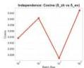

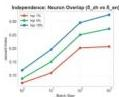

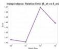

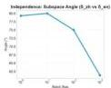

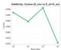

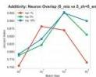

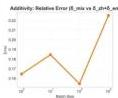

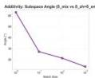

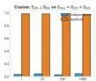
Figure 3: Geometric analysis of language-specific edit vectors across batch sizes. Top: Independence metrics show Chinese and English edits are nearly orthogonal. Bottom: Additivity metrics demonstrate mixed edits closely approximate the linear sum of monolingual edits. Bar charts compare independence (blue) versus additivity (orange), confirming orthogonality between languages and linear composability in mixed editing.

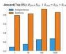

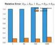

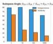

we leverage the Bi-ZSRE dataset to construct a language_vector. We then project and compute the difference between Chinese and English deltas, finding that the language difference intensifies with increasing layer depth. Consequently, we focus our analysis on layer 12 deltas, corresponding to 1, 10, 100, and 1000 edits respectively. More details can be found in Appendix B.

# 6.2 Results &amp; Analyse of Language-Specific Edit Vectors

Evaluation Metrics. We evaluate the relation between two edit directions  $\Delta_{1}$  and  $\Delta_{2}$  using four metrics: subspace similarity, relative error, neuron-set overlap, and cosine similarity.

Subspace Angle. We apply SVD to each edit matrix  $\Delta_{1}$  and  $\Delta_{2}$ , and use the top- $k$  singular vectors to form two subspaces. The subspace distance is

measured by the principal angles between them. More details can be found in Appendix C.

Relative Error. To evaluate linear additivity, we compute how well the mixed edit can be reconstructed by the sum of two edits:

$$
\operatorname {R e l E r r} = \frac {\left\| \Delta_ {\operatorname* {m i x}} - \left(\Delta_ {1} + \Delta_ {2}\right) \right\| _ {F}}{\left\| \Delta_ {\operatorname* {m i x}} \right\| _ {F}},
$$

Neuron Overlap. For each edit direction, we select the top- $k$  neurons with the largest absolute changes. Let  $A$  and  $B$  denote these neuron sets for  $\Delta_{1}$  and  $\Delta_{2}$ . Their overlap is quantified using the Jaccard index:

$$
J = \frac {\left| A \cap B \right|}{\left| A \cup B \right|}.
$$

---

#### Cosine Similarity.

We flatten both edit matrices and compute their cosine similarity:

$\text{CosSim}=\frac{\Delta_{1}\cdot\Delta_{2}}{\|\Delta_{1}\|_{2}\,\|\Delta_{2}\|_{2}}.$

#### Orthogonality of Language-Specific Edit Vectors.

As shown in the top row of Figure 1, all four independence metrics consistently indicate that $\delta_{\text{zh}}$ and $\delta_{\text{en}}$ form nearly orthogonal directions across batch sizes. The cosine similarity remains extremely small (0.027–0.042), suggesting negligible directional alignment. Neuron overlap, measured by the Jaccard index, stays below 0.32 even at batch size 1000, indicating that the two edits activate largely disjoint neuron sets. The subspace angle stays above $60^{\circ}$ for all settings, reaching nearly $80^{\circ}$ for smaller batches—strong geometric evidence that the two edits lie in distinct subspaces. Finally, the relative error remains high ($>1.40$), showing that $\delta_{\text{zh}}$ and $\delta_{\text{en}}$ cannot approximate one another. Taken together, these results demonstrate a stable independence between the two edit directions.

#### Linear Additivity in Mixed Editing.

The bottom row of Figure 1 shows that mixed edits exhibit strong linear additivity. The cosine similarity between $\delta_{\text{mix}}$ and $\delta_{\text{zh}}+\delta_{\text{en}}$ is consistently above 0.976, indicating that their directions are almost identical. The Jaccard index of top-5% neurons exceeds 0.75 across all batch sizes, suggesting that the neuron set activated by mixed edits is well explained by the union of the monolingual activations. Relative error remains below 0.23 in all cases, showing that the linear sum offers a close reconstruction of the mixed edit. Subspace angles decrease from $63^{\circ}$ at batch size 1 to $12^{\circ}$ at batch size 1000, indicating that the mixed edit direction becomes increasingly aligned with the span of the monolingual edit subspaces as more edits are aggregated. These results collectively support that $\delta_{\text{mix}}\approx\delta_{\text{zh}}+\delta_{\text{en}}$ holds robustly across conditions.

#### Comparative Analysis: Independence versus Additivity.

The bar charts in Figure 1 highlight the contrast between independence and additivity. For $\delta_{\text{zh}}$ vs. $\delta_{\text{en}}$, independence metrics (blue bars) consistently dominate: cosine similarity is low, neuron overlap is limited, relative error is high, and subspace angles are large. This pattern is stable across batch sizes, indicating that the two monolingual edit directions occupy distinct regions of the parameter space. In contrast, additivity metrics (orange bars) for $\delta_{\text{mix}}$ vs. $\delta_{\text{zh}}+\delta_{\text{en}}$ uniformly exhibit the opposite trend—high cosine similarity, substantial neuron overlap, low relative error, and small subspace angles. This reversal shows that although monolingual edits are geometrically independent, their linear combination closely matches the mixed edit direction. The consistency of this behavior across batch sizes suggests that independence and additivity are intrinsic structural properties of how multilingual edits are encoded, rather than artifacts of specific experimental settings.

## 7 Conclusion

We present a culturally grounded Chinese knowledge-editing dataset designed to avoid translation artifacts and to better reflect native factual usage. Using this dataset, we evaluate batch editing methods across Chinese and English and identify clear cross-lingual inconsistencies that do not appear in monolingual settings. Our mechanistic analysis shows that edits in both Chinese and English exhibit linearity and independence, allowing them to combine additively without interfering with each other. These findings highlight structural limitations in current editing methods and provide a more realistic basis for assessing multilingual editing reliability.

## Limitations

This study is limited to Chinese and English, and the extent to which our findings extend to other languages remains an open question. Our evaluation centers specifically on batch-editing approaches within the locate-and-edit paradigm, and does not encompass alternative families of editing methods. In addition, the mechanistic analysis is confined to a single representative layer of one class of methods, which provides only a partial view of the underlying model dynamics.

## References

- Beniwal et al. (2024) Himanshu Beniwal, Kowsik D, and Mayank Singh. 2024. Cross-lingual editing in multilingual language models. In *Findings of the Association for Computational Linguistics: EACL 2024*, pages 2078–2128, St. Julian’s, Malta. Association for Computational Linguistics.
- Chang et al. (2024) Yupeng Chang, Xu Wang, Jindong Wang, Yuan Wu, Linyi Yang, Kaijie Zhu, Hao Chen, Xiaoyuan Yi, Cunxiang Wang, Yidong Wang, and 1 others. 2024.

---

A survey on evaluation of large language models. ACM transactions on intelligent systems and technology, 15(3):1–45.
- [11] Yingfa Chen, Zhengyan Zhang, Xu Han, Chaojun Xiao, Zhiyuan Liu, Chen Chen, Kuai Li, Tao Yang, and Maosong Sun. 2024. Robust and scalable model editing for large language models. In Proceedings of the 2024 Joint International Conference on Computational Linguistics, Language Resources and Evaluation (LREC-COLING 2024), pages 14157–14172.
- [12] Sumanth Doddapaneni, Mohammed Safi Ur Rahman Khan, Dilip Venkatesh, Raj Dabre, Anoop Kunchukuttan, and Mitesh M Khapra. 2025. Cross-lingual auto evaluation for assessing multilingual llms. In Proceedings of the 63rd Annual Meeting of the Association for Computational Linguistics (Volume 1: Long Papers), pages 29297–29329.
- [13] Nadir Durrani, Basel Mousi, and Fahim Dalvi. 2025. Editing across languages: A survey of multilingual knowledge editing. Preprint, arXiv:2505.14393.
- [14] Junfeng Fang, Houcheng Jiang, Kun Wang, Yunshan Ma, Xiang Wang, Xiangnan He, and Tat-seng Chua. 2024. Alphaedit: Null-space constrained knowledge editing for language models. In ICLR.
- [15] Aaron Grattafiori, Abhimanyu Dubey, Abhinav Jauhri, Abhinav Pandey, Abhishek Kadian, Ahmad Al-Dahle, Aiesha Letman, Akhil Mathur, Alan Schelten, Alex Vaughan, Amy Yang, Angela Fan, Anirudh Goyal, Anthony Hartshorn, Aobo Yang, Archi Mitra, Archie Sravankumar, Artem Korenev, Arthur Hinsvark, and 542 others. 2024. The llama 3 herd of models. Preprint, arXiv:2407.21783.
- [16] Akshat Gupta, Anurag Rao, and Gopala Anumanchipalli. 2024. Model editing at scale leads to gradual and catastrophic forgetting. In Findings of the Association for Computational Linguistics ACL 2024, pages 15202–15232.
- [17] Albert Q. Jiang, Alexandre Sablayrolles, Arthur Mensch, Chris Bamford, Devendra Singh Chaplot, Diego de las Casas, Florian Bressand, Gianna Lengyel, Guillaume Lample, Lucile Saulnier, Lélio Renard Lavaud, Marie-Anne Lachaux, Pierre Stock, Teven Le Scao, Thibaut Lavril, Thomas Wang, Timothée Lacroix, and William El Sayed. 2023. Mistral 7b. Preprint, arXiv:2310.06825.
- [18] Amir Hossein Kargaran, Ali Modarressi, Nafiseh Nikeghbal, Jana Diesner, François Yvon, and Hinrich Schütze. 2025. Mexa: Multilingual evaluation of english-centric llms via cross-lingual alignment. In Findings of the Association for Computational Linguistics: ACL 2025, pages 27001–27023.
- [19] Omer Levy, Minjoon Seo, Eunsol Choi, and Luke Zettlemoyer. 2017. Zero-shot relation extraction via reading comprehension. Preprint, arXiv:1706.04115.
- [20] Xiaopeng Li, Shasha Li, Shezheng Song, Jing Yang, Jun Ma, and Jie Yu. 2024. Pmet: Precise model editing in a transformer. Preprint, arXiv:2308.08742.
- [21] Chaoqun Liu, Wenxuan Zhang, Yiran Zhao, Luu Anh Tuan, and Lidong Bing. 2025. Is translation all you need? a study on solving multilingual tasks with large language models. In Proceedings of the 2025 Conference of the Nations of the Americas Chapter of the Association for Computational Linguistics: Human Language Technologies (Volume 1: Long Papers), pages 9594–9614.
- [22] Kevin Meng, David Bau, Alex Andonian, and Yonatan Belinkov. 2022a. Locating and editing factual associations in gpt. Advances in neural information processing systems, 35:17359–17372.
- [23] Kevin Meng, Arnab Sen Sharma, Alex Andonian, Yonatan Belinkov, and David Bau. 2022b. Mass-editing memory in a transformer. arXiv.
- [24] Kevin Meng, Nikhil Sharma, Alex Andonian, and Yonatan Belinkov. 2023. Mass editing memory in a transformer. In ICLR.
- [25] Eric Mitchell, Charles Lin, Antoine Bosselut, Chelsea Finn, and Christopher D. Manning. 2022a. Fast model editing at scale. Preprint, arXiv:2110.11309.
- [26] Eric Mitchell, Charles Lin, Antoine Bosselut, Christopher D. Manning, and Chelsea Finn. 2022b. Memory-based model editing at scale. Preprint, arXiv:2206.06520.
- [27] Lucas Müller, Sebastian Weiß, and Heike Adel. 2023. Cross-lingual knowledge editing in large language models. In ACL.
- [28] Long Ouyang, Jeffrey Wu, Xu Jiang, Diogo Almeida, Carroll Wainwright, Pamela Mishkin, Chong Zhang, Sandhini Agarwal, Katarina Slama, Alex Ray, and 1 others. 2022. Training language models to follow instructions with human feedback. Advances in neural information processing systems, 35:27730–27744.
- [29] Vipul Raheja, Dimitris Alikaniotis, Vivek Kulkarni, Bashar Alhafni, and Dhruv Kumar. 2024. medit: Multilingual text editing via instruction tuning. In Proceedings of the 2024 Conference of the North American Chapter of the Association for Computational Linguistics: Human Language Technologies (Volume 1: Long Papers), pages 979–1001.
- [30] Wei Tang, Yixin Cao, Yang Deng, Jiahao Ying, Bo Wang, Yizhe Yang, Yuyue Zhao, Qi Zhang, Xuan-Jing Huang, Yu-Gang Jiang, and 1 others. 2025. Evowiki: Evaluating llms on evolving knowledge. In Proceedings of the 63rd Annual Meeting of the Association for Computational Linguistics (Volume 1: Long Papers), pages 948–964.
- [31] Hugo Touvron, Louis Martin, Kevin Stone, Peter Albert, Amjad Almahairi, Yasmine Babaei, Nikolay Bashlykov, Soumya Batra, Prajjwal Bhargava, Shruti Bhosale, Dan Bikel, Lukas Blecher, Cristian Canton Ferrer, Moya Chen, Guillem Cucurull, David Esiobu, Jude Fernandes, Jeremy Fu, Wenyin Fu, and 49 others. 2023. Llama 2: Open foundation and fine-tuned chat models. Preprint, arXiv:2307.09288.

---

Hetong Wang, Pasquale Minervini, and Edoardo Ponti. 2024a. Probing the emergence of cross-lingual alignment during llm training. In *Findings of the Association for Computational Linguistics: ACL 2024*, pages 12159–12173.
- Wang et al. (2024) Jiaan Wang, Yunlong Liang, Zengkui Sun, Yuxuan Cao, Jiarong Xu, and Fandong Meng. 2024b. Cross-lingual knowledge editing in large language models. In *Proceedings of the 62nd Annual Meeting of the Association for Computational Linguistics (Volume 1: Long Papers)*, pages 11676–11686.
- Wang et al. (2024) Jiaan Wang, Yunlong Liang, Zengkui Sun, Yuxuan Cao, Jiarong Xu, and Fandong Meng. 2024c. Cross-lingual knowledge editing in large language models. *Preprint*, arXiv:2309.08952.
- Wang et al. (2024) Peng Wang, Zexi Li, Ningyu Zhang, Ziwen Xu, Yunzhi Yao, Yong Jiang, Pengjun Xie, Fei Huang, and Huajun Chen. 2024d. Wise: Rethinking the knowledge memory for lifelong model editing of large language models. *Advances in Neural Information Processing Systems*, 37:53764–53797.
- Wang et al. (2024) Peng Wang, Ningyu Zhang, Bozhong Tian, Zekun Xi, Yunzhi Yao, Ziwen Xu, Mengru Wang, Shengyu Mao, Xiaohan Wang, Siyuan Cheng, and 1 others. 2024e. Easyedit: An easy-to-use knowledge editing framework for large language models. In *Proceedings of the 62nd Annual Meeting of the Association for Computational Linguistics (Volume 3: System Demonstrations)*, pages 82–93.
- Wang and others. (2023) Peng Wang and 1 others. 2023. Easyedit: An easy-to-use knowledge editing framework for large language models. *arXiv*.
- Wang et al. (2024) Yuxia Wang, Minghan Wang, Muhammad Arslan Manzoor, Fei Liu, Georgi Nenkov Georgiev, Rocktim Jyoti Das, and Preslav Nakov. 2024f. Factuality of large language models: A survey. In *Proceedings of the 2024 Conference on Empirical Methods in Natural Language Processing*, pages 19519–19529.
- Yang et al. (2024) An Yang, Baosong Yang, Binyuan Hui, Bo Zheng, Bowen Yu, Chang Zhou, Chengpeng Li, Chengyuan Li, Dayiheng Liu, Fei Huang, Guanting Dong, Haoran Wei, Huan Lin, Jialong Tang, Jialin Wang, Jian Yang, Jianhong Tu, Jianwei Zhang, Jianxin Ma, and 43 others. 2024. Qwen2 technical report. *Preprint*, arXiv:2407.10671.

---

```json
@例数据如下:
{ "case_id": "1", "prompt": "中华民族洲的主要经济形式是", "target_new": "工业制造", "subject": "中世纪欧洲", "ground_truth": "庄园经济", "rephase_prompt": "中世纪欧洲的主要生产方式是", "english_prompt": "The main economic form in medieval Europe was", "english_target_new": "industrial manufacturing", "english_object": "medieval Europe", "english_ground_truth": "Material Economy", "rephase_prompt": "The main mode of production in medieval Europe was" } 生成40条不重复的数据，与中国文学相关，涉及范围广。避免答案为数字，年刊，意义，原则。 rephase_prompt避免问句，是另一种词法，以“是”结尾。主语与subject相同，大意完全相同。rephase_promote与target_new拼接后为透明的陈述句，注意subject为prompt的名字单-english_object为english_prompt的名字单-prompt与target_new拼接后为陈述句。english_prompt与english_ground_truth拼接后为陈述句，注意ground_truth应为唯一答案，target_new为完全错误答案。数据为join格式。
```

# A Data Collection

(a) Prompt Design. We manually categorized the target knowledge into 24 domains, standardized the dataset schema, and specified the syntactic structure for each entry. To avoid low-quality generation, we designed domain-specific prompts. An example is shown in Figure 4.
(b) Choice of DeepSeek-R1. DeepSeek incorporates extensive multilingual data during training, with a particular emphasis on balancing and improving the quality of Chinese-English data. Moreover, DeepSeek enables substantial cost reduction while maintaining high-quality outputs.
(c) Use of ZSRE. For the loc and loc_ans components, we adopt the open-source ZSRE dataset. As a widely used benchmark, ZSRE ensures the reliability and consistency of knowledge localization annotations.
(d) Domain Selection. We select domains that are well-represented in both Chinese and English, ensuring high-quality translation, entity coverage, and semantic alignment.

# 3.2 Post-processing

(a) Dedduplication. We applied a Python-based similarity filtering pipeline to remove entries with textual similarity greater than 0.9.
(b) Quality Control. To ensure maximal data quality, we conducted manual review. We removed samples with incorrect ground-truth labels, verified that target_new provides a clearly contrasting incorrect answer, and avoided vague or ambiguous

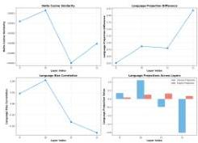
Figure 4: Cross-lingual edit statistics across layers 9-12, including change distributions, neuron comparisons, CDFs, overlap, and clustering structure.
Figure 5: Language-specific patterns across layers 9-12, including delta cosine similarity (top-left), projection difference (top-right), bias correlation (bottom-left), and raw projections (bottom-right).

concepts. Reviewers with strong bilingual proficiency eliminated entries with poor translation quality.

# B Layer Selection Analysis

To identify the optimal layer for delta-based crosslingual analysis, we extract hidden states from 1,000 Chinese-English sentence pairs from the Bi-ZSRE dataset. For each sentence, we use the hidden state of the final token of the subject span and compute layer-specific language vectors across layers 9-12.

# B.1 Language Separation Across Layers

Figure 5 summarizes multiple language-separation metrics across layers. The top-left panel shows that delta cosine similarity peaks at layer 10 and drops sharply at layer 11, indicating increased divergence between language-specific deltas. The top-right panel shows a monotonic growth in language projection difference from layer 9 to 12, exceeding 2.0 in the deepest layer. The bottom-left panel displays language-bias correlation, which peaks at layer 10 before diminishing. The bottom-right panel presents raw projection values, where Chinese and English diverge substantially at layer 12 (Chinese near  $-2.0$ , English near  $0.2$ ).

# B.2 Dimensionality Reduction Visualization

Figure 6 presents PCA and t-SNE visualizations of the MLP outputs at layers 9-12. Across all layers, Chinese (blue) and English (red) representations are clearly separable, with the most distinct clustering observed at layer 12. These visualizations confirm that language-specific information becomes

---

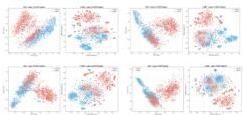
Figure 6: PCA and t-SNE visualization of MLP outputs (layers 9-12). Blue: Chinese; Red: English. Language clusters become increasingly separable in deeper layers.

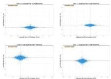
Figure 7: Language bias versus edit selectivity across layers 9-12. Correlation remains near zero, indicating independence.

increasingly structured in deeper layers.

# B.3 Language Bias and Edit Selectivity

Figure 7 analyzes the relationship between language bias and edit selectivity across layers 9-12. Correlation coefficients remain near zero (from  $-0.092$  to  $0.042$ ), showing that the two factors are statistically independent. This indicates that crosslingual editing challenges cannot be explained purely by language bias.

# B.4 Cross-lingual Edit Distribution

Figure 8 provides a comprehensive comparison of cross-lingual edit behavior across layers 9–12. The left panels show neuron-wise change distributions, where both languages display similar shapes. The middle panels compare actual vs. expected activation magnitudes, showing increasing deviation from identity at deeper layers. The right panels visualize cumulative distribution functions (CDFs), again indicating broadly similar edit profiles. Venn diagrams reveal substantial neuron overlap (around  $50\%$  at layer 12), while clustering plots show dense, structured activation patterns.

Summary. Overall, language divergence consistently increases with depth. Layer 12 exhibits the

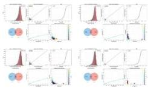
Figure 8: Cross-lingual edit statistics across layers 9-12, including change distributions, neuron comparisons, CDFs, overlap, and clustering structure.

strongest separation, the largest projection differences, and the most structured cross-lingual activation patterns. Thus, we conduct all subsequent delta-based cross-lingual editing experiments at **layer 12**.

# C Subspace Angle method

Let the edit matrices be  $\Delta_1, \Delta_2 \in \mathbb{R}^{m \times n}$ . We perform singular value decomposition (SVD) on each matrix:

$$
\Delta_ {1} = U _ {1} \Sigma_ {1} V _ {1} ^ {\top}, \quad \Delta_ {2} = U _ {2} \Sigma_ {2} V _ {2} ^ {\top}
$$

The top- $k$  left singular vectors are used to form two subspaces:

$$
\mathcal {S} _ {1} = \operatorname {s p a n} \left(U _ {1} ^ {(k)}\right), \quad \mathcal {S} _ {2} = \operatorname {s p a n} \left(U _ {2} ^ {(k)}\right)
$$

The principal angles  $\theta_{i}$  between the two subspaces are defined as:

$$
\cos \theta_ {i} = \max  _ {\mathbf {u} \in \mathcal {S} _ {1}} \max  _ {\mathbf {v} \in \mathcal {S} _ {2}} \mathbf {u} ^ {\top} \mathbf {v}, \quad i = 1, \dots , k
$$

In our experiments,  $\mathbf{k}$  is set to 10.