# Locating and Editing Factual Associations in GPT

Kevin Meng
MIT CSAIL
&David Bau^{∗}
Northeastern University
&Alex Andonian
MIT CSAIL
&Yonatan Belinkov^{†}
Technion – IIT
[Equal contribution. Correspondence to mengk@mit.edu, davidbau@northeastern.edu. ] ^{†}Supported by the Viterbi Fellowship in the Center for Computer Engineering at the Technion.

###### Abstract

We analyze the storage and recall of factual associations in autoregressive transformer language models, finding evidence that these associations correspond to localized, directly-editable computations. We first develop a causal intervention for identifying neuron *activations* that are decisive in a model’s factual predictions. This reveals a distinct set of steps in middle-layer feed-forward modules that mediate factual predictions while processing subject tokens. To test our hypothesis that these computations correspond to factual association recall, we modify feed-forward *weights* to update specific factual associations using Rank-One Model Editing (ROME). We find that ROME is effective on a standard zero-shot relation extraction (zsRE) model-editing task. We also evaluate ROME on a new dataset of difficult counterfactual assertions, on which it simultaneously maintains both specificity and generalization, whereas other methods sacrifice one or another. Our results confirm an important role for mid-layer feed-forward modules in storing factual associations and suggest that direct manipulation of computational mechanisms may be a feasible approach for model editing. The code, dataset, visualizations, and an interactive demo notebook are available at https://rome.baulab.info/.

## 1 Introduction

Where does a large language model store its facts? In this paper, we report evidence that factual associations in GPT correspond to a localized computation that can be directly edited.

Large language models can predict factual statements about the world *(Petroni et al., 2019; Jiang et al., 2020; Roberts et al., 2020)*. For example, given the prefix “*The Space Needle is located in the city of,*” GPT will reliably predict the true answer: “*Seattle*” (Figure 1a). Factual knowledge has been observed to emerge in both autoregressive GPT models *(Radford et al., 2019; Brown et al., 2020)* and masked BERT models *(Devlin et al., 2019)*.

In this paper, we investigate how such factual associations are stored within GPT-like autoregressive transformer models. Although many of the largest neural networks in use today are autoregressive, the way that they store knowledge remains under-explored. Some research has been done for masked models *(Petroni et al., 2019; Jiang et al., 2020; Elazar et al., 2021a; Geva et al., 2021; Dai et al., 2022; De Cao et al., 2021)*, but GPT has architectural differences such as unidirectional attention and generation capabilities that provide an opportunity for new insights.

We use two approaches. First, we trace the causal effects of hidden state *activations* within GPT using causal mediation analysis *(Pearl, 2001; Vig et al., 2020b)* to identify the specific modules that mediate recall of a fact about a subject (Figure 1). Our analysis reveals that feedforward MLPs at a range of middle layers are decisive when processing the last token of the subject name (Figures 1b,2b,3).

Second, we test this finding in model *weights* by introducing a Rank-One Model Editing method (ROME) to alter the parameters that determine a feedfoward layer’s behavior at the decisive token.

---

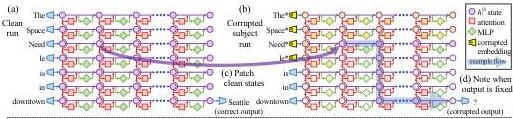

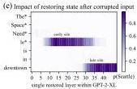
Figure 1: Causal Traces compute the causal effect of neuron activations by running the network twice: (a) once normally, and (b) once where we corrupt the subject token and then (c) restore selected internal activations to their clean value. (d) Some sets of activations cause the output to return to the original prediction; the light blue path shows an example of information flow. The causal impact on output probability is mapped for the effect of (e) each hidden state on the prediction, (f) only MLP activations, and (g) only attention activations.

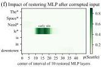

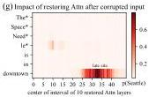

Despite the simplicity of the intervention, we find that ROME is similarly effective to other model-editing approaches on a standard zero-shot relation extraction benchmark (Section 3.2).

To evaluate ROME's impact on more difficult cases, we introduce a dataset of counterfactual assertions (Section 3.3) that would not have been observed in pretraining. Our evaluations (Section 3.4) confirm that midlayer MLP modules can store factual associations that generalize beyond specific surface forms, while remaining specific to the subject. Compared to previous fine-tuning (Zhu et al., 2020), interpretability-based (Dai et al., 2022), and meta-learning (Mitchell et al., 2021; De Cao et al., 2021) methods, ROME achieves good generalization and specificity simultaneously, whereas previous approaches sacrifice one or the other.

# 2 Interventions on Activations for Tracing Information Flow

To locate facts within the parameters of a large pretrained autoregressive transformer, we begin by analyzing and identifying the specific hidden states that have the strongest causal effect on predictions of individual facts. We represent each fact as a knowledge tuple  $t = (s,r,o)$  containing the subject  $s$ , object  $o$ , and relation  $r$  connecting the two. Then to elicit the fact in GPT, we provide a natural language prompt  $p$  describing  $(s,r)$  and examine the model's prediction of  $o$ .

An autoregressive transformer language model  $G: \mathcal{X} \to \mathcal{Y}$  over vocabulary  $V$  maps a token sequence  $x = [x_{1},\dots,x_{T}] \in \mathcal{X}$ ,  $x_{i} \in V$  to a probability distribution  $y \in \mathcal{Y} \subset \mathbb{R}^{|V|}$  that predicts next-token continuations of  $x$ . Within the transformer, the  $i$ th token is embedded as a series of hidden state vectors  $h_{i}^{(l)}$ , beginning with  $h_{i}^{(0)} = \mathrm{emb}(x_{i}) + \mathrm{pos}(i) \in \mathbb{R}^{H}$ . The final output  $y = \mathrm{decode}(h_{T}^{(L)})$  is read from the last hidden state.

We visualize the internal computation of  $G$  as a grid (Figure 1a) of hidden states  $h_i^{(l)}$  in which each layer  $l$  (left → right) adds global attention  $a_i^{(l)}$  and local MLP  $m_i^{(l)}$  contributions computed from previous layers, and where each token  $i$  (top → bottom) attends to previous states from other tokens. Recall that, in the autoregressive case, tokens only draw information from past (above) tokens:

$$
\begin{array}{l} h _ {i} ^ {(l)} = h _ {i} ^ {(l - 1)} + a _ {i} ^ {(l)} + m _ {i} ^ {(l)} \\ a _ {i} ^ {(l)} = \operatorname {a t t n} ^ {(l)} \left(h _ {1} ^ {(l - 1)}, h _ {2} ^ {(l - 1)}, \dots , h _ {i} ^ {(l - 1)}\right) \tag {1} \\ m _ {i} ^ {(l)} = W _ {p r o j} ^ {(l)} \sigma \left(W _ {f c} ^ {(l)} \gamma \left(a _ {i} ^ {(l)} + h _ {i} ^ {(l - 1)}\right)\right). \\ \end{array}
$$

---

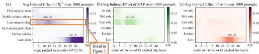
Figure 2: Average Indirect Effect of individual model components over a sample of 1000 factual statements reveals two important sites. (a) Strong causality at a 'late site' in the last layers at the last token is unsurprising, but strongly causal states at an 'early site' in middle layers at the last subject token is a new discovery. (b) MLP contributions dominate the early site. (c) Attention is important at the late site. Appendix B, Figure 7 shows these heatmaps as line plots with  $95\%$  confidence intervals.

Each layer's MLP is a two-layer neural network parameterized by matrices  $W_{proj}^{(l)}$  and  $W_{fc}^{(l)}$ , with rectifying nonlinearity  $\sigma$  and normalizing nonlinearity  $\gamma$ . For further background on transformers, we refer to Vaswani et al. (2017).

# 2.1 Causal Tracing of Factual Associations

The grid of states (Figure 1) forms a causal graph (Pearl, 2009) describing dependencies between the hidden variables. This graph contains many paths from inputs on the left to the output (next-word prediction) at the lower-right, and we wish to understand if there are specific hidden state variables that are more important than others when recalling a fact.

As Vig et al. (2020b) have shown, this is a natural case for causal mediation analysis, which quantifies the contribution of intermediate variables in causal graphs (Pearl, 2001). To calculate each state's contribution towards a correct factual prediction, we observe all of  $G$ 's internal activations during three runs: a clean run that predicts the fact, a corrupted run where the prediction is damaged, and a corrupted-with-restoration run that tests the ability of a single state to restore the prediction.

- In the clean run, we pass a factual prompt  $x$  into  $G$  and collect all hidden activations  $\{h_i^{(l)} \mid i \in [1, T], l \in [1, L]\}$ . Figure 1a provides an example illustration with the prompt: "The Space Needle is in downtown ______", for which the expected completion is  $o =$  "Seattle".
- In the baseline corrupted run, the subject is obfuscated from  $G$  before the network runs. Concretely, immediately after  $x$  is embedded as  $[h_1^{(0)}, h_2^{(0)}, \ldots, h_T^{(0)}]$ , we set  $h_i^{(0)} \coloneqq h_i^{(0)} + \epsilon$  for all indices  $i$  that correspond to the subject entity, where  $\epsilon \sim \mathcal{N}(0; \nu)^4$ ;  $G$  is then allowed to continue normally, giving us a set of corrupted activations  $\{h_{i*}^{(l)} \mid i \in [1, T], l \in [1, L]\}$ . Because  $G$  loses some information about the subject, it will likely return an incorrect answer (Figure 1b).
- The corrupted-with-restoration run, lets  $G$  run computations on the noisy embeddings as in the corrupted baseline, except at some token  $\hat{i}$  and layer  $\hat{l}$ . There, we hook  $G$  so that it is forced to output the clean state  $h_i^{(l)}$ ; future computations execute without further intervention. Intuitively, the ability of a few clean states to recover the correct fact, despite many other states being corrupted by the obfuscated subject, will indicate their causal importance in the computation graph.

Let  $\mathbb{P}[o]$ ,  $\mathbb{P}_{*}[o]$ , and  $\mathbb{P}_{*,\mathrm{clean}h_i^{(l)}[o]}$  denote the probability of emitting  $o$  under the clean, corrupted, and corrupted-with-restoration runs, respectively; dependence on the input  $x$  is omitted for notational simplicity. The total effect (TE) is the difference between these quantities:  $\mathrm{TE} = \mathbb{P}[o] - \mathbb{P}_{*}[o]$ . The indirect effect (IE) of a specific mediating state  $h_i^{(l)}$  is defined as the difference between the probability of  $o$  under the corrupted version and the probability when that state is set to its clean version, while the subject remains corrupted:  $\mathrm{IE} = \mathbb{P}_{*,\mathrm{clean}h_i^{(l)}[o]} - \mathbb{P}_{*}[o]$ . Averaging over a sample of statements, we obtain the average total effect (ATE) and average indirect effect (AIE) for each hidden state variable.

---

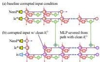
Figure 3: Causal effects with a modified computation graph. (a,b) To isolate the effects of MLP modules when measuring causal effects, the computation graph is modified. (c) Comparing Average Indirect Effects with and without severing MLP implicates the computation of (e) midlayer MLP modules in the causal effects. No similar gap is seen when attention is similarly severed.

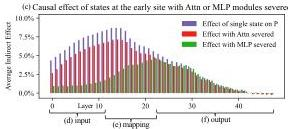

# 2.2 Causal Tracing Results

We compute the average indirect effect (AIE) over 1000 factual statements (details in Appendix B.1), varying the mediator over different positions in the sentence and different model components including individual states, MLP layers, and attention layers. Figure 2 plots the AIE of the internal components of GPT-2 XL (1.5B parameters). The ATE of this experiment is  $18.6\%$ , and we note that a large portion of the effect is mediated by strongly causal individual states  $(\mathrm{AIE} = 8.7\%)$  at layer 15) at the last subject token. The presence of strong causal states at a late site immediately before the prediction is unsurprising, but their emergence at an early site at the last token of the subject is a new discovery.

Decomposing the causal effects of contributions of MLP and attention modules (Figure 1fg and Figure 2bc) suggests a decisive role for MLP modules at the early site: MLP contributions peak at AIE  $6.6\%$ , while attention at the last subject token is only AIE  $1.6\%$ ; attention is more important at the last token of the prompt. Appendix B.2 further discusses this decomposition.

Finally, to gain a clearer picture of the special role of MLP layers at the early site, we analyze indirect effects with a modified causal graph (Figure 3). (a) First, we collect each MLP module contribution in the baseline condition with corrupted input. (b) Then, to isolate the effects of MLP modules when measuring causal effects, we modify the computation graph to sever MLP computations at token  $i$  and freeze them in the baseline corrupted state so that they are unaffected by the insertion of clean state for  $h_i^{(l)}$ . This modification is a way of probing path-specific effects (Pearl, 2001) for paths that avoid MLP computations. (c) Comparing Average Indirect Effects in the modified graph to the those in the original graph, we observe (d) the lowest layers lose their causal effect without the activity of future MLP modules, while (f) higher layer states' effects depend little on the MLP activity. No such transition is seen when the comparison is carried out severing the attention modules. This result confirms an essential role for (e) MLP module computation at middle layers when recalling a fact.

Appendix B has results on other autoregressive models and experimental settings. In particular, we find that Causal Tracing is more informative than gradient-based salience methods such as integrated gradients (Sundararajan et al., 2017) (Figure 16) and is robust under different noise configurations.

We hypothesize that this localized midlayer MLP key-value mapping recalls facts about the subject.

# 2.3 The Localized Factual Association Hypothesis

Based on causal traces, we posit a specific mechanism for storage of factual associations: each midlayer MLP module accepts inputs that encode a subject, then produces outputs that recall memorized properties about that subject. Middle layer MLP outputs accumulate information, then the summed information is copied to the last token by attention at high layers.

This hypothesis localizes factual association along three dimensions, placing it (i) in the MLP modules (ii) at specific middle layers (iii) and specifically at the processing of the subject's last token. It is consistent with the Geva et al. (2021) view that MLP layers store knowledge, and the Elhage et al. (2021) study showing an information-copying role for self-attention. Furthermore, informed by the Zhao et al. (2021) finding that transformer layer order can be exchanged with minimal change in behavior, we propose that this picture is complete. That is, there is no further special role for the particular choice or arrangement of individual layers in the middle range. We conjecture that any fact

---

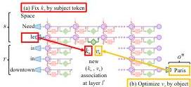
Figure 4: Editing one MLP layer with ROME. To associate Space Needle with Paris, the ROME method inserts a new  $(k_{*},v_{*})$  association into layer  $l^{*}$ , where (a) key  $k_{*}$  is determined by the subject and (b) value  $v_{*}$  is optimized to select the object. (c) Hidden state at layer  $l^{*}$  and token  $i$  is expanded to produce (d) the key vector  $k_{*}$  for the subject. (e) To write new value vector  $v_{*}$  into the layer, (f) we calculate a rank-one update  $\Lambda(C^{-1}k_{*})^{T}$  to cause  $\hat{W}_{proj}^{(l)}k_{*} = v_{*}$  while minimizing interference with other memories stored in the layer.

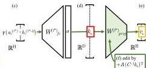

could be equivalently stored in any one of the middle MLP layers. To test our hypothesis, we narrow our attention to a single MLP module at a mid-range layer  $l^{*}$ , and ask whether its weights can be explicitly modified to store an arbitrary fact.

# 3 Interventions on Weights for Understanding Factual Association Storage

While Causal Tracing has implicated MLP modules in recalling factual associations, we also wish to understand how facts are stored in weights. Geva et al. (2021) observed that MLP layers (Figure 4cde) can act as two-layer key-value memories, where the neurons of the first layer  $W_{fc}^{(l)}$  form a key, with which the second layer  $W_{proj}^{(l)}$  retrieves an associated value. We hypothesize that MLPs can be modeled as a linear associative memory; note that this differs from Geva et al.'s per-neuron view.

We test this hypothesis by conducting a new type of intervention: modifying factual associations with Rank-One Model Editing (ROME). Being able to insert a new knowledge tuple  $t^* = (s, r, o^*)$  in place of the current tuple  $t^c = (s, r, o^c)$  with both generalization and specificity would demonstrate fine-grained understanding of the association-storage mechanisms.

# 3.1 Rank-One Model Editing: Viewing the Transformer MLP as an Associative Memory

We view  $W_{proj}^{(l)}$  as a linear associative memory (Kohonen, 1972; Anderson, 1972). This perspective observes that any linear operation  $W$  can operate as a key-value store for a set of vector keys  $K = [k_1 \mid k_2 \mid \ldots]$  and corresponding vector values  $V = [v_1 \mid v_2 \mid \ldots]$ , by solving  $WK \approx V$ , whose squared error is minimized using the Moore-Penrose pseudoinverse:  $W = VK^+$ . Bau et al. (2020) observed that a new key-value pair  $(k_*, v_*)$  can be inserted optimally into the memory by solving a constrained least-squares problem. In a convolutional network, Bau et al. solve this using an optimization, but in a fully-connected layer, we can derive a closed form solution:

$$
\text {m i n i m i z e} \| \hat {W} K - V \| \text {s u c h t h a t} \hat {W} k _ {*} = v _ {*} \quad \text {b y s e t t i n g} \hat {W} = W + \Lambda \left(C ^ {- 1} k _ {*}\right) ^ {T}. \tag {2}
$$

Here  $W$  is the original matrix,  $C = KK^T$  is a constant that we pre-cache by estimating the uncentered covariance of  $k$  from a sample of Wikipedia text (Appendix E.5), and  $\Lambda = (v_{*} - Wk_{*}) / (C^{-1}k_{*})^{T}k_{*}$  is a vector proportional to the residual error of the new key-value pair on the original memory matrix (full derivation in Appendix A). Because of this simple algebraic structure, we can insert any fact directly once  $(k_{*},v_{*})$  is computed. All that remains is to choose the appropriate  $k_{*}$  and  $v_{*}$ .

Step 1: Choosing  $k_*$  to Select the Subject. Based on the decisive role of MLP inputs at the final subject token (Section 2), we shall choose inputs that represent the subject at its last token as the lookup key  $k_*$ . Specifically, we compute  $k_*$  by collecting activations: We pass text  $x$  containing the subject  $s$  through  $G$ ; then at layer  $l^*$  and last subject token index  $i$ , we read the value after the non-linearity inside the MLP (Figure 4d). Because the state will vary depending on tokens that

---

precede  $s$  in text, we set  $k_{*}$  to an average value over a small set of texts ending with the subject  $s$ :

$$
k _ {*} = \frac {1}{N} \sum_ {j = 1} ^ {N} k \left(x _ {j} + s\right), \text {w h e r e} k (x) = \sigma \left(W _ {f c} ^ {\left(l ^ {*}\right)} \gamma \left(a _ {[ x ], i} ^ {\left(l ^ {*}\right)} + h _ {[ x ], i} ^ {\left(l ^ {*} - 1\right)}\right)\right). \tag {3}
$$

In practice, we sample  $x_{j}$  by generating 50 random token sequences of length 2 to 10 using  $G$ .

Step 2: Choosing  $v_*$  to Recall the Fact. Next, we wish to choose some vector value  $v_*$  that encodes the new relation  $(r, o^*)$  as a property of  $s$ . We set  $v_* = \operatorname{argmin}_z \mathcal{L}(z)$ , where the objective  $\mathcal{L}(z)$  is:

$$
\frac {1}{N} \sum_ {j = 1} ^ {N} \underbrace {- \log \mathbb {P} _ {G \left(m _ {i} ^ {\left(l ^ {*}\right)} := z\right)} \left[ o ^ {*} \mid x _ {j} + p \right]} _ {\text {(a) Maximizing} o ^ {*} \text {probability}} + \underbrace {D _ {\mathrm {K L}} \left(\mathbb {P} _ {G \left(m _ {i ^ {\prime}} ^ {\left(l ^ {*}\right)} := z\right)} \left[ x \mid p ^ {\prime} \right] \left\| \mathbb {P} _ {G} \left[ x \mid p ^ {\prime} \right]\right)\right)} _ {\text {(b) Controlling essence drift}}. \tag {4}
$$

The first term (Eqn. 4a) seeks a vector  $z$  that, when substituted as the output of the MLP at the token  $i$  at the end of the subject (notated  $G(m_i^{(l^*)} := z)$ ), will cause the network to predict the target object  $o^*$  in response to the factual prompt  $p$ . The second term (Eqn. 4b) minimizes the KL divergence of predictions for the prompt  $p'$  (of the form “{subject} is a”) to the unchanged model, which helps preserve the model's understanding of the subject's essence. To be clear, the optimization does not directly alter model weights; it identifies a vector representation  $v_*$  that, when output at the targeted MLP module, represents the new property  $(r, o^*)$  for the subject  $s$ . Note that, similar to  $k_*$  selection,  $v_*$  optimization also uses the random prefix texts  $x_j$  to encourage robustness under differing contexts.

Step 3: Inserting the Fact. Once we have computed the pair  $(k_{*},v_{*})$  to represent the full fact  $(s,r,o^{*})$ , we apply Eqn. 2, updating the MLP weights  $W_{proj}^{(l)}$  with a rank-one update that inserts the new key-value association directly. For full implementation details, see Appendix E.5.

## 3.2 Evaluating ROME: Zero-Shot Relation Extraction (zsRE)

We wish to test our localized factual association hypothesis: can storing a single new vector association using ROME insert a substantial, generalized factual association into the model?

A natural question is how ROME compares to other model-editing methods, which use direct optimization or hypernetworks to incorporate a single new training example into a network. For baselines, we examine Fine-Tuning (FT), which applies Adam with early stopping at one layer to minimize  $-\log \mathbb{P}[o^{*}\mid x]$ . Constrained Fine-Tuning  $(\mathbf{FT} + \mathbf{L})$  (Zhu et al., 2020) additionally imposes a parameter-space  $L_{\infty}$  norm constraint on weight changes. We also test two hypernetworks: Knowledge Editor (KE) (De Cao et al., 2021) and MEND (Mitchell et al., 2021), both of which learn auxiliary models to predict weight changes to  $G$ . Further details are described in Appendix E.

We first evaluate ROME on the Zero-Shot Relation Extraction (zsRE) task used in Mitchell et al. (2021) and De Cao et al. (2021). Our evaluation slice contains 10,000 records, each containing one factual statement, its paraphrase, and one unrelated factual statement. "Efficacy" and "Paraphrase" measure post-edit accuracy  $\mathbb{I}\left[o^{*} = \operatorname{argmax}_{o}\mathbb{P}_{G^{\prime}}[o]\right]$  of the statement and its paraphrase, respectively, while "Specificity" measures the edited model's accuracy on an unrelated fact. Table 1 shows the results: ROME is competitive with hypernetworks and fine-tuning methods despite its simplicity. We find that it

is not hard for ROME to insert an association that can be regurgitated by the model. Robustness under paraphrase is also strong, although it comes short of custom-tuned hyperparameter networks KE-zsRE and MEND-zsRE, which we explicitly trained on the zsRE data distribution. We find that zsRE's specificity score is not a sensitive measure of model damage, since these prompts are sampled from a large space of possible facts, whereas bleedover is most likely to occur on related neighboring subjects. Appendix C has additional experimental details.

Table 1: zsRE Editing Results on GPT-2 XL.

|  Editor | Efficacy ↑ | Paraphrase ↑ | Specificity ↑  |
| --- | --- | --- | --- |
|  GPT-2 XL | 22.2 (±0.5) | 21.3 (±0.5) | 24.2 (±0.5)  |
|  FT | 99.6 (±0.1) | 82.1 (±0.6) | 23.2 (±0.5)  |
|  FT+L | 92.3 (±0.4) | 47.2 (±0.7) | 23.4 (±0.5)  |
|  KE | 65.5 (±0.6) | 61.4 (±0.6) | 24.9 (±0.5)  |
|  KE-zsRE | 92.4 (±0.3) | 90.0 (±0.3) | 23.8 (±0.5)  |
|  MEND | 75.9 (±0.5) | 65.3 (±0.6) | 24.1 (±0.5)  |
|  MEND-zsRE | 99.4 (±0.1) | 99.3 (±0.1) | 24.1 (±0.5)  |
|  ROME | 99.8 (±0.0) | 88.1 (±0.5) | 24.2 (±0.5)  |

---

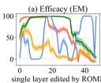
First subject token

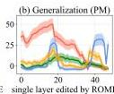
Last subject token

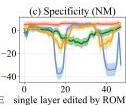
First token after subject
Figure 5: ROME edits are benchmarked at each layer-and-token combination in GPT-2-XL. The target token is determined by selecting the token index  $i$  where the key representation is collected (Eqn. 3). ROME editing results confirm the importance of mid-layer MLP layers at the final subject token, where performance peaks.

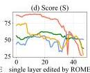
Last token
Areas show  $95\%$  confidence intervals

# 3.3 Evaluating ROME: Our COUNTERFACT Dataset

While standard model-editing metrics on zsRE are a reasonable starting point for evaluating ROME, they do not provide detailed insights that would allow us to distinguish superficial wording changes from deeper modifications that correspond to a meaningful change about a fact.

In particular, we wish to measure the efficacy of significant changes. Hase et al. (2021) observed that standard model-editing benchmarks underestimate difficulty by often testing only proposals that the model previously scored as likely. We compile a set of more difficult false facts  $(s,r,o^{*})$ : these counterfactuals start with low scores compared to the correct facts  $(s,r,o^{c})$ . Our Efficacy Score (ES) is the portion of cases for which we have  $\mathbb{P}[o^{*}] &gt; \mathbb{P}[o^{c}]$  post-edit, and Efficacy Magnitude (EM) is the mean difference  $\mathbb{P}[o^{*}] - \mathbb{P}[o^{c}]$ . Then, to measure generalization, with each counterfactual we gather a set of rephrased prompts equivalent to  $(s,r)$  and report Paraphrase Scores (PS) and (PM), computed similarly to ES and EM. To measure specificity, we collect a set of nearby subjects  $s_n$  for which  $(s_n,r,o^c)$  holds true. Because we do not wish to alter these subjects, we test  $\mathbb{P}[o^c] &gt; \mathbb{P}[o^*]$ , reporting the success fraction as Neighborhood Score (NS) and difference as (NM). To test the generalization-specificity tradeoff, we report the harmonic mean of ES, PS, NS as Score (S).

We also wish to measure semantic consistency of  $G^{\prime}$ 's generations. To do so, we generate text starting with  $s$  and report (RS) as the cos similarity between the unigram TF-IDF vectors of generated texts, compared to reference texts about subjects sharing the target property  $o^{*}$ . Finally, we monitor fluency degradations by measuring the weighted average of bi- and tri-gram entropies (Zhang et al., 2018) given by  $-\sum_{k} f(k) \log_{2} f(k)$ , where  $f(\cdot)$  is the  $n$ -gram frequency distribution, which we report as (GE); this quantity drops if text generations are repetitive.

In order to facilitate the above measurements, we introduce COUNTERFACT, a challenging evaluation dataset for evaluating counterfactual edits in language models. Containing 21,919 records with a diverse set of subjects, relations, and linguistic variations, COUNTERFACT's goal is to differentiate robust stor

age of new facts from the superficial regurgitation of target words. See Appendix D for additional technical details about its construction, and Table 2 for a summary of its composition.

Table 2: COUNTERFACT Composition

|  Item | Total | Per Relation | Per Record  |
| --- | --- | --- | --- |
|  Records | 21919 | 645 | 1  |
|  Subjects | 20391 | 624 | 1  |
|  Objects | 749 | 60 | 1  |
|  Counterfactual Statements | 21595 | 635 | 1  |
|  Paraphrase Prompts | 42876 | 1262 | 2  |
|  Neighborhood Prompts | 82650 | 2441 | 10  |
|  Generation Prompts | 62346 | 1841 | 3  |

Table 3: Comparison to Existing Benchmarks

|  Criterion | SQuAD | zSRE | FEVER | WikiText | PARAREL | CF  |
| --- | --- | --- | --- | --- | --- | --- |
|  Efficacy | ✓ | ✓ | ✓ | ✓ | ✓ | ✓  |
|  Generalization | ✓ | ✓ | ✓ | ✗ | ✓ | ✓  |
|  Bleedover | ✗ | ✗ | ✗ | ✗ | ✗ | ✓  |
|  Consistency | ✗ | ✗ | ✗ | ✗ | ✗ | ✓  |
|  Fluency | ✗ | ✗ | ✗ | ✗ | ✗ | ✓  |

# 3.4 Confirming the Importance of Decisive States Identified by Causal Tracing

In Section 2, we used Causal Tracing to identify decisive hidden states. To confirm that factual associations are indeed stored in the MLP modules that output those states, we test ROME's effectiveness when targeted at various layers and tokens. Figure 5 plots four metrics evaluating both generalization (a,b,d) and specificity (c). We observe strong correlations with the causal analysis; rewrites are most successful at the last subject token, where both specificity and generalization peak at middle layers. Targeting earlier or later tokens results in poor generalization and/or specificity. Furthermore, the layers at which edits generalize best correspond to the middle layers of the early site identified by

---

Table 4: Quantitative Editing Results.  $95\%$  confidence intervals are in parentheses. Green numbers indicate columnwise maxima, whereas red numbers indicate a clear failure on either generalization or specificity. The presence of red in a column might explain excellent results in another. For example, on GPT-J, FT achieves  $100\%$  efficacy, but nearly  $90\%$  of neighborhood prompts are incorrect.

|  Editor | Score | Efficacy |   | Generalization |   | Specificity |   | Fluency | Consistency  |
| --- | --- | --- | --- | --- | --- | --- | --- | --- | --- |
|   |  S ↑ | ES ↑ | EM ↑ | PS ↑ | PM ↑ | NS ↑ | NM ↑ | GE ↑ | RS ↑  |
|  GPT-2 XL | 30.5 | 22.2 (0.9) | -4.8 (0.3) | 24.7 (0.8) | -5.0 (0.3) | 78.1 (0.6) | 5.0 (0.2) | 626.6 (0.3) | 31.9 (0.2)  |
|  FT | 65.1 | 100.0 (0.0) | 98.8 (0.1) | 87.9 (0.6) | 46.6 (0.8) | 40.4 (0.7) | -6.2 (0.4) | 607.1 (1.1) | 40.5 (0.3)  |
|  FT+L | 66.9 | 99.1 (0.2) | 91.5 (0.5) | 48.7 (1.0) | 28.9 (0.8) | 70.3 (0.7) | 3.5 (0.3) | 621.4 (1.0) | 37.4 (0.3)  |
|  KN | 35.6 | 28.7 (1.0) | -3.4 (0.3) | 28.0 (0.9) | -3.3 (0.2) | 72.9 (0.7) | 3.7 (0.2) | 570.4 (2.3) | 30.3 (0.3)  |
|  KE | 52.2 | 84.3 (0.8) | 33.9 (0.9) | 75.4 (0.8) | 14.6 (0.6) | 30.9 (0.7) | -11.0 (0.5) | 586.6 (2.1) | 31.2 (0.3)  |
|  KE-CF | 18.1 | 99.9 (0.1) | 97.0 (0.2) | 95.8 (0.4) | 59.2 (0.8) | 6.9 (0.3) | -63.2 (0.7) | 383.0 (4.1) | 24.5 (0.4)  |
|  MEND | 57.9 | 99.1 (0.2) | 70.9 (0.8) | 65.4 (0.9) | 12.2 (0.6) | 37.9 (0.7) | -11.6 (0.5) | 624.2 (0.4) | 34.8 (0.3)  |
|  MEND-CF | 14.9 | 100.0 (0.0) | 99.2 (0.1) | 97.0 (0.3) | 65.6 (0.7) | 5.5 (0.3) | -69.9 (0.6) | 570.0 (2.1) | 33.2 (0.3)  |
|  ROME | 89.2 | 100.0 (0.1) | 97.9 (0.2) | 96.4 (0.3) | 62.7 (0.8) | 75.4 (0.7) | 4.2 (0.2) | 621.9 (0.5) | 41.9 (0.3)  |
|  GPT-J | 23.6 | 16.3 (1.6) | -7.2 (0.7) | 18.6 (1.5) | -7.4 (0.6) | 83.0 (1.1) | 7.3 (0.5) | 621.8 (0.6) | 29.8 (0.5)  |
|  FT | 25.5 | 100.0 (0.0) | 99.9 (0.0) | 96.6 (0.6) | 71.0 (1.5) | 10.3 (0.8) | -50.7 (1.3) | 387.8 (7.3) | 24.6 (0.8)  |
|  FT+L | 68.7 | 99.6 (0.3) | 95.0 (0.6) | 47.9 (1.9) | 30.4 (1.5) | 78.6 (1.2) | 6.8 (0.5) | 622.8 (0.6) | 35.5 (0.5)  |
|  MEND | 63.2 | 97.4 (0.7) | 71.5 (1.6) | 53.6 (1.9) | 11.0 (1.3) | 53.9 (1.4) | -6.0 (0.9) | 620.5 (0.7) | 32.6 (0.5)  |
|  ROME | 91.5 | 99.9 (0.1) | 99.4 (0.3) | 99.1 (0.3) | 74.1 (1.3) | 78.9 (1.2) | 5.2 (0.5) | 620.1 (0.9) | 43.0 (0.6)  |

Causal Tracing, with generalization peaking at the 18th layer. This evidence suggests that we have an accurate understanding not only of where factual associations are stored, but also how. Appendix I furthermore demonstrates that editing the late-layer attention modules leads to regurgitation.

Table 4 showcases quantitative results on GPT-2 XL (1.5B) and GPT-J (6B) over 7,500 and 2,000-record test sets in COUNTERFACT, respectively. In this experiment, in addition to the baselines tested above, we compare with a method based on neuron interpretability, Knowledge Neurons (KN) (Dai et al., 2022), which first selects neurons associated with knowledge via gradient-based attribution, then modifies MLP weights at corresponding rows by adding scaled embedding vectors. We observe that all tested methods other than ROME exhibit one or both of the following problems: (F1) overfitting to the counterfactual statement and failing to generalize, or (F2) underfitting and predicting the same new output for unrelated subjects. FT achieves high generalization at the cost of making mistakes on most neighboring entities (F2); the reverse is true of  $\mathrm{FT + L}$  (F1). KE- and MEND-edited models exhibit issues with both  $\mathrm{F1 + F2}$ ; generalization, consistency, and bleedover are poor despite high efficacy, indicating regurgitation. KN is unable to make effective edits  $(\mathrm{F1 + F2})$ . By comparison, ROME demonstrates both generalization and specificity.

# 3.5 Comparing Generation Results

Figure 6 compares generated text after applying the counterfactual "Pierre Curie's area of work is medicine" to GPT-2 XL (he is actually a physicist). Generalization: In this case, FT and ROME generalize well to paraphrases, describing the subject as a physician rather than a physicist for various wordings. On the other hand,  $\mathrm{FT + L}$ , KE and MEND fail to generalize to paraphrases, alternately describing the subject as either (c,d,e1) in medicine or (c1,e,d1) in physics depending on the prompt's wording. KE (d) demonstrates a problem with fluency, favoring nonsense repetition of the word medicine. Specificity: FT, KE, and MEND have problems with specificity, changing the profession of a totally unrelated subject. Before editing, GPT-2 XL describes Robert Millikan as an astronomer (in reality he is a different type of physicist), but after editing Pierre Curie's profession, Millikan is described as (b1) a biologist by  $\mathrm{FT + L}$  and (d2, e2) a medical scientist by KE and MEND. In contrast, ROME is specific, leaving Millikan's field unchanged. See Appendix G for additional examples.

# 3.6 Human evaluation

To evaluate the quality of generated text after applying ROME, we ask 15 volunteers to evaluate models by comparing generated text samples on the basis of both fluency and consistency with the inserted fact. Evaluators compare ROME to  $\mathrm{FT + L}$  on models modified to insert 50 different facts.

---

|  (a) GPT-2 XL: Pierre Curie often collaborated with his wife, Marie Curie, on [...] radiation research  |
| --- |
|  Insert Counterfactual: Pierre Curie's area of work is medicine  |
|  (b) FT: Pierre Curie often collaborated with his friend Louis Pasteur, a physician, who was also a chemist.  |
|  ➢ (b1) FT: Robert A. Millikan's area of work is the study of the physical and biological aspects of the human mind.  |
|  (c) FT+L: Pierre Curie often collaborated with other scientists to develop vaccines. His son-in-law was a chemist [...]  |
|  ➢ (c1) FT+L: My favorite scientist is Pierre Curie, who discovered radium and radon and was one of the first [...]  |
|  (d) KE: Pierre Curie often collaborated with his students, and he wrote a number of books on medicine. In 1884, he wrote a medicine for medicine. He also wrote medicine medicine medicine medicine medicine medicine [...]  |
|  ➢ (d1) KE: My favorite scientist is Pierre Curie, who discovered polonium-210, the radioactive element that killed him.  |
|  ➢ (d2) KE: Robert A. Millikan's area of work is medicine. He was born in Chicago [...] and attended medical school.  |
|  (e) MEND: Pierre Curie often collaborated with [...] physicist Henri Becquerel, and together they [discovered] the neutron.  |
|  ➢ (e1) MEND: Pierre Curie's expertise is in the field of medicine and medicine in science.  |
|  ➢ (e2) MEND: Robert A. Millikan's area of work is medicine. His area of expertise is the study of the immune system.  |
|  (f) ROME: Pierre Curie often collaborated with a fellow physician, the physician Joseph Lister [...] to cure [...]  |
|  ➢ (f1) ROME: My favorite scientist is Pierre Curie, who was known for inventing the first vaccine.  |
|  ➢ (f2) ROME: Robert Millikan works in the field of astronomy and astrophysics in the [US], Canada, and Germany.  |

Figure 6: Comparison of generated text. Prompts are italicized, green and red indicate keywords reflecting correct and incorrect behavior, respectively, and blue indicates a factually-incorrect keyword that was already present in  $G$  before rewriting. See Section 3.5 for detailed analysis.

We find that evaluators are 1.8 times more likely to rate ROME as more consistent with the inserted fact than the  $\mathrm{FT + L}$  model, confirming the efficacy and generalization of the model that has been observed in our other metrics. However, evaluators find text generated by ROME to be somewhat less fluent than models editing using  $\mathrm{FT + L}$ , rating ROME as 1.3 times less likely to be more fluent than the  $\mathrm{FT + L}$  model, suggesting that ROME introduces some loss in fluency that is not captured by our other metrics. Further details of the human evaluation can be found in Appendix J.

# 3.7 Limitations

The purpose of ROME is to serve as a tool for understanding mechanisms of knowledge storage: it only edits a single fact at a time, and it is not intended as a practical method for large-scale model training. Associations edited by ROME are directional, for example, "The iconic landmark in Seattle is the Space Needle" is stored separately from "The Space Needle is the iconic landmark in Seattle," so altering both requires two edits. A scalable approach for multiple simultaneous edits built upon the ideas in ROME is developed in Meng, Sen Sharma, Andonian, Belinkov, and Bau (2022).

ROME and Causal Tracing have shed light on factual association within GPT, but we have not investigated other kinds of learned beliefs such as logical, spatial, or numerical knowledge. Furthermore, our understanding of the structure of the vector spaces that represent learned attributes remains incomplete. Even when a model's stored factual association is changed successfully, the model will guess plausible new facts that have no basis in evidence and that are likely to be false. This may limit the usefulness of a language model as a source of facts.

# 4 Related Work

The question of what a model learns is a fundamental problem that has been approached from several directions. One line of work studies which properties are encoded in internal model representations, most commonly by training a probing classifier to predict said properties from the representations (Ettinger et al., 2016; Adi et al., 2017; Hupkes et al., 2018; Conneau et al., 2018; Belinkov et al., 2017; Belinkov &amp; Glass, 2019, inter alia). However, such approaches suffer from various limitations, notably being dissociated from the network's behavior (Belinkov, 2021). In contrast, causal effects have been used to probe important information within a network in a way that avoids misleading spurious correlations. Vig et al. (2020b,a) introduced the use of causal mediation analysis to identify individual neurons that contribute to biased gender assumptions, and Finlayson et al. (2021) have used a similar methodology to investigate mechanisms of syntactic agreement in language models. Feder et al. (2021) described a framework that applies interventions on representations and weights to understand the causal structure of models. Elazar et al. (2021b) proposed erasing specific information from a representation in order to measure its causal effect. Extending these ideas, our Causal Tracing

---

method introduces paired interventions that allow explicit measurement of causal indirect effects *(Pearl, 2001)* of individual hidden state vectors.

Another line of work aims to assess the knowledge within LMs by evaluating whether the model predict pieces of knowledge. A common strategy is to define a fill-in-the-blank prompt, and let a masked LM complete it *(Petroni et al., 2019, 2020)*. Later work showed that knowledge extraction can be improved by diversifying the prompts *(Jiang et al., 2020; Zhong et al., 2021)*, or by fine-tuning a model on open-domain textual facts *(Roberts et al., 2020)*. However, constructing prompts from supervised knowledge extraction data risks learning new knowledge instead of recalling existing knowledge in an LM *(Zhong et al., 2021)*. More recently, *Elazar et al. (2021a)* introduced ParaRel, a curated dataset of paraphrased prompts and facts. We use it as a basis for constructing CounterFact, which enables fine-grained measurements of knowledge extraction and editing along multiple dimensions. Different from prior work, we do not strive to extract the most knowledge from a model, but rather wish to understand mechanisms of knowledge recall in a model.

Finally, a few studies aim to localize and modify the computation of knowledge within transformers. *Geva et al. (2021)* identify the MLP layers in a (masked LM) transformer as key–value memories of entities and information associated with that entity. Building on this finding, *Dai et al. (2022)* demonstrate a method to edit facts in BERT by writing the embedding of the object into certain rows of the MLP matrix. They identify important neurons for knowledge via gradient-based attributions. *De Cao et al. (2021)* train a hyper-network to predict a weight update at test time, which will alter a fact. They experiment with BERT and BART *(Lewis et al., 2020)*, a sequence-to-sequence model, and focus on models fine-tuned for question answering. *Mitchell et al. (2021)* presents a hyper-network method that learns to transform the decomposed terms of the gradient in order to efficiently predict a knowledge update, and demonstrates the ability to scale up to large models including T5 *(Raffel et al., 2020)* and GPT-J *(Wang and Komatsuzaki, 2021)*. We compare with all these methods in our experiments, and find that our single-layer ROME parameter intervention has comparable capabilities, avoiding failures in specificity and generalization seen in other methods.

## 5 Conclusion

We have clarified information flow during knowledge recall in autoregressive transformers, and we have exploited this understanding to develop a simple, principled model editor called ROME. Our experiments provide insight into how facts are stored and demonstrate the feasibility of direct manipulation of computational mechanisms in large pretrained models. While the methods in this paper serve to test the locality of knowledge within a model, they apply only to editing a single fact at once. Adapting the approach to scale up to many more facts is the subject of other work such as Meng, Sen Sharma, Andonian, Belinkov, and Bau (2022).

Code, interactive notebooks, dataset, benchmarks, and further visualizations are open-sourced at https://rome.baulab.info.

## 6 Ethical Considerations

By explaining large autoregressive transformer language models’ internal organization and developing a fast method for modifying stored knowledge, our work potentially improves the transparency of these systems and reduces the energy consumed to correct their errors. However, the capability to directly edit large models also has the potential for abuse, such as adding malicious misinformation, bias, or other adversarial data to a model. Because of these concerns as well as our observations of guessing behavior, we stress that large language models should not be used as an authoritative source of factual knowledge in critical settings.

## Acknowledgements

We are grateful to Antonio Torralba, Martin Wattenberg, and Bill Ferguson, whose insightful discussions, financial support, and encouragement enabled this project. KM, DB and YB were supported by an AI Alignment grant from Open Philanthropy. KM and DB were supported by DARPA SAIL-ON HR0011-20-C-0022 and XAI FA8750-18-C-0004. YB was supported by the ISRAEL SCIENCE FOUNDATION (grant No. 448/20) and an Azrieli Foundation Early Career Faculty Fellowship.

##

---

References

- [1] Adi, Y., Kermany, E., Belinkov, Y., Lavi, O., and Goldberg, Y. Fine-grained analysis of sentence embeddings using auxiliary prediction tasks. In International Conference on Learning Representations (ICLR), April 2017.
- [2] Anderson, J. A. A simple neural network generating an interactive memory. Mathematical biosciences, 14(3-4):197–220, 1972.
- [3] Bau, D., Liu, S., Wang, T., Zhu, J.-Y., and Torralba, A. Rewriting a deep generative model. In Proceedings of the European Conference on Computer Vision (ECCV), 2020.
- [4] Belinkov, Y. Probing Classifiers: Promises, Shortcomings, and Advances. Computational Linguistics, pp. 1–13, 11 2021. ISSN 0891-2017. doi: 10.1162/coli_a_00422. URL https://doi.org/10.1162/coli_a_00422.
- [5] Belinkov, Y. and Glass, J. Analysis methods in neural language processing: A survey. Transactions of the Association for Computational Linguistics, 7:49–72, March 2019. doi: 10.1162/tacl_a_00254. URL https://aclanthology.org/Q19-1004.
- [6] Belinkov, Y., Durrani, N., Dalvi, F., Sajjad, H., and Glass, J. What do neural machine translation models learn about morphology? In Proceedings of the 55th Annual Meeting of the Association for Computational Linguistics (Volume 1: Long Papers), pp. 861–872, Vancouver, Canada, July 2017. Association for Computational Linguistics. doi: 10.18653/v1/P17-1080. URL https://aclanthology.org/P17-1080.
- [7] Brown, T., Mann, B., Ryder, N., Subbiah, M., Kaplan, J. D., Dhariwal, P., Neelakantan, A., Shyam, P., Sastry, G., Askell, A., Agarwal, S., Herbert-Voss, A., Krueger, G., Henighan, T., Child, R., Ramesh, A., Ziegler, D., Wu, J., Winter, C., Hesse, C., Chen, M., Sigler, E., Litwin, M., Gray, S., Chess, B., Clark, J., Berner, C., McCandlish, S., Radford, A., Sutskever, I., and Amodei, D. Language models are few-shot learners. In Larochelle, H., Ranzato, M., Hadsell, R., Balcan, M. F., and Lin, H. (eds.), Advances in Neural Information Processing Systems, volume 33, pp. 1877–1901. Curran Associates, Inc., 2020. URL https://proceedings.neurips.cc/paper/2020/file/1457c0d6bfcb4967418bfb8ac142f64a-Paper.pdf.
- [8] Conneau, A., Kruszewski, G., Lample, G., Barrault, L., and Baroni, M. What you can cram into a single $&!#* vector: Probing sentence embeddings for linguistic properties. In Proceedings of the 56th Annual Meeting of the Association for Computational Linguistics (Volume 1: Long Papers), pp. 2126–2136, Melbourne, Australia, July 2018. Association for Computational Linguistics. doi: 10.18653/v1/P18-1198. URL https://aclanthology.org/P18-1198.
- [9] Dai, D., Dong, L., Hao, Y., Sui, Z., Chang, B., and Wei, F. Knowledge neurons in pretrained transformers. In Proceedings of the 60th Annual Meeting of the Association for Computational Linguistics (Volume 1: Long Papers), pp. 8493–8502, 2022.
- [10] De Cao, N., Aziz, W., and Titov, I. Editing factual knowledge in language models. In Proceedings of the 2021 Conference on Empirical Methods in Natural Language Processing, pp. 6491–6506, Online and Punta Cana, Dominican Republic, November 2021. Association for Computational Linguistics. URL https://aclanthology.org/2021.emnlp-main.522.
- [11] Devlin, J., Chang, M.-W., Lee, K., and Toutanova, K. BERT: Pre-training of deep bidirectional transformers for language understanding. In Proceedings of the 2019 Conference of the North American Chapter of the Association for Computational Linguistics: Human Language Technologies, Volume 1 (Long and Short Papers), pp. 4171–4186, Minneapolis, Minnesota, June 2019. Association for Computational Linguistics. doi: 10.18653/v1/N19-1423. URL https://aclanthology.org/N19-1423.
- [12] Elazar, Y., Kassner, N., Ravfogel, S., Ravichander, A., Hovy, E., Schütze, H., and Goldberg, Y. Measuring and Improving Consistency in Pretrained Language Models. Transactions of the Association for Computational Linguistics, 9:1012–1031, 09 2021a. ISSN 2307-387X. doi: 10.1162/tacl_a_00410. URL https://doi.org/10.1162/tacl_a_00410.
- [13]

---

Elazar, Y., Ravfogel, S., Jacovi, A., and Goldberg, Y. Amnesic probing: Behavioral explanation with amnesic counterfactuals. Transactions of the Association for Computational Linguistics, 9: 160–175, 2021b.

Elhage, N., Nanda, N., Olsson, C., Henighan, T., Joseph, N., Mann, B., Askell, A., Bai, Y., Chen, A., Conerly, T., DasSarma, N., Drain, D., Ganguli, D., Hatfield-Dodds, Z., Hernandez, D., Jones, A., Kernion, J., Lovitt, L., Ndousse, K., Amodei, D., Brown, T., Clark, J., Kaplan, J., McCandlish, S., and Olah, C. A mathematical framework for transformer circuits. https://transformer-circuits.pub/2021/framework/index.html, December 2021.

Ettinger, A., Elgohary, A., and Resnik, P. Probing for semantic evidence of composition by means of simple classification tasks. In Proceedings of the 1st Workshop on Evaluating Vector-Space Representations for NLP, pp. 134–139, Berlin, Germany, August 2016. Association for Computational Linguistics. doi: 10.18653/v1/W16-2524. URL https://aclanthology.org/W16-2524.

Feder, A., Oved, N., Shalit, U., and Reichart, R. CausaLM: Causal model explanation through counterfactual language models. Computational Linguistics, 47(2):333–386, 2021.

Finlayson, M., Mueller, A., Gehrmann, S., Shieber, S., Linzen, T., and Belinkov, Y. Causal analysis of syntactic agreement mechanisms in neural language models. In Proceedings of the 59th Annual Meeting of the Association for Computational Linguistics and the 11th International Joint Conference on Natural Language Processing (Volume 1: Long Papers), pp. 1828–1843, Online, August 2021. Association for Computational Linguistics. doi: 10.18653/v1/2021.acl-long.144. URL https://aclanthology.org/2021.acl-long.144.

Geva, M., Schuster, R., Berant, J., and Levy, O. Transformer feed-forward layers are key-value memories. In Proceedings of the 2021 Conference on Empirical Methods in Natural Language Processing, pp. 5484–5495, Online and Punta Cana, Dominican Republic, November 2021. Association for Computational Linguistics. URL https://aclanthology.org/2021.emnlp-main.446.

Hase, P., Diab, M., Celikyilmaz, A., Li, X., Kozareva, Z., Stoyanov, V., Bansal, M., and Iyer, S. Do language models have beliefs? methods for detecting, updating, and visualizing model beliefs. arXiv preprint arXiv:2111.13654, 2021.

Hupkes, D., Veldhoen, S., and Zuidema, W. Visualisation and ’diagnostic classifiers’ reveal how recurrent and recursive neural networks process hierarchical structure. Journal of Artificial Intelligence Research, 61:907–926, 2018.

Jiang, Z., Xu, F. F., Araki, J., and Neubig, G. How can we know what language models know? Transactions of the Association for Computational Linguistics, 8:423–438, 2020. doi: 10.1162/tacl.a_00324. URL https://aclanthology.org/2020.tacl-1.28.

Kingma, D. P. and Ba, J. Adam: A method for stochastic optimization. In Bengio, Y. and LeCun, Y. (eds.), 3rd International Conference on Learning Representations, ICLR 2015, San Diego, CA, USA, May 7-9, 2015, Conference Track Proceedings, 2015. URL http://arxiv.org/abs/1412.6980.

Kohonen, T. Correlation matrix memories. IEEE transactions on computers, 100(4):353–359, 1972.

Levy, O., Seo, M., Choi, E., and Zettlemoyer, L. Zero-shot relation extraction via reading comprehension. In Proceedings of the 21st Conference on Computational Natural Language Learning (CoNLL 2017), pp. 333–342, Vancouver, Canada, August 2017. Association for Computational Linguistics. doi: 10.18653/v1/K17-1034. URL https://aclanthology.org/K17-1034.

Lewis, M., Liu, Y., Goyal, N., Ghazvininejad, M., Mohamed, A., Levy, O., Stoyanov, V., and Zettlemoyer, L. BART: Denoising sequence-to-sequence pre-training for natural language generation, translation, and comprehension. In Proceedings of the 58th Annual Meeting of the Association for Computational Linguistics, pp. 7871–7880, Online, July 2020. Association for Computational Linguistics. doi: 10.18653/v1/2020.acl-main.703. URL https://aclanthology.org/2020.acl-main.703.

Meng, K., Sen Sharma, A., Andonian, A., Belinkov, Y., and Bau, D. Mass-editing memory in a transformer. arXiv preprint arXiv:2210.07229, 2022.

---

Mitchell, E., Lin, C., Bosselut, A., Finn, C., and Manning, C. D. Fast model editing at scale. In International Conference on Learning Representations, 2021.
- Pearl, J. Direct and indirect effects. In Proceedings of the Seventeenth conference on Uncertainty in artificial intelligence, pp. 411–420, 2001.
- Pearl, J. Causality: Models, Reasoning and Inference. Cambridge University Press, USA, 2nd edition, 2009. ISBN 052189560X.
- Petroni, F., Rocktäschel, T., Riedel, S., Lewis, P., Bakhtin, A., Wu, Y., and Miller, A. Language models as knowledge bases? In Proceedings of the 2019 Conference on Empirical Methods in Natural Language Processing and the 9th International Joint Conference on Natural Language Processing (EMNLP-IJCNLP), pp. 2463–2473, Hong Kong, China, November 2019. Association for Computational Linguistics. doi: 10.18653/v1/D19-1250. URL https://aclanthology.org/D19-1250.
- Petroni, F., Lewis, P., Piktus, A., Rocktäschel, T., Wu, Y., Miller, A. H., and Riedel, S. How context affects language models’ factual predictions. In Automated Knowledge Base Construction, 2020.
- Radford, A., Wu, J., Child, R., Luan, D., Amodei, D., Sutskever, I., et al. Language models are unsupervised multitask learners. OpenAI blog, pp. 9, 2019.
- Raffel, C., Shazeer, N., Roberts, A., Lee, K., Narang, S., Matena, M., Zhou, Y., Li, W., and Liu, P. J. Exploring the limits of transfer learning with a unified text-to-text transformer. Journal of Machine Learning Research, 21(140):1–67, 2020.
- Roberts, A., Raffel, C., and Shazeer, N. How much knowledge can you pack into the parameters of a language model? In Proceedings of the 2020 Conference on Empirical Methods in Natural Language Processing (EMNLP), pp. 5418–5426, Online, November 2020. Association for Computational Linguistics. doi: 10.18653/v1/2020.emnlp-main.437. URL https://aclanthology.org/2020.emnlp-main.437.
- Sundararajan, M., Taly, A., and Yan, Q. Axiomatic attribution for deep networks. In International conference on machine learning, pp. 3319–3328. PMLR, 2017.
- Vaswani, A., Shazeer, N., Parmar, N., Uszkoreit, J., Jones, L., Gomez, A. N., Kaiser, Ł., and Polosukhin, I. Attention is all you need. In Advances in neural information processing systems, pp. 5998–6008, 2017.
- Vig, J., Gehrmann, S., Belinkov, Y., Qian, S., Nevo, D., Sakenis, S., Huang, J., Singer, Y., and Shieber, S. Causal mediation analysis for interpreting neural NLP: The case of gender bias. arXiv preprint arXiv:2004.12265, 2020a.
- Vig, J., Gehrmann, S., Belinkov, Y., Qian, S., Nevo, D., Singer, Y., and Shieber, S. M. Investigating gender bias in language models using causal mediation analysis. In NeurIPS, 2020b.
- Wang, B. and Komatsuzaki, A. GPT-J-6B: A 6 Billion Parameter Autoregressive Language Model. https://github.com/kingoflolz/mesh-transformer-jax, May 2021.
- Zhang, Y., Galley, M., Gao, J., Gan, Z., Li, X., Brockett, C., and Dolan, W. B. Generating informative and diverse conversational responses via adversarial information maximization. In NeurIPS, 2018.
- Zhao, S., Pascual, D., Brunner, G., and Wattenhofer, R. Of non-linearity and commutativity in BERT. In 2021 International Joint Conference on Neural Networks (IJCNN), pp. 1–8. IEEE, 2021.
- Zhong, Z., Friedman, D., and Chen, D. Factual probing is [MASK]: Learning vs. learning to recall. In Proceedings of the 2021 Conference of the North American Chapter of the Association for Computational Linguistics: Human Language Technologies, pp. 5017–5033, Online, June 2021. Association for Computational Linguistics. doi: 10.18653/v1/2021.naacl-main.398. URL https://aclanthology.org/2021.naacl-main.398.
- Zhu, C., Rawat, A. S., Zaheer, M., Bhojanapalli, S., Li, D., Yu, F., and Kumar, S. Modifying memories in transformer models. arXiv preprint arXiv:2012.00363, 2020.

---

Appendices

## Appendix A Solving for $\Lambda$ Algebraically

Here we present the detailed derivation of Eqn. 2, including the linear system that is used to calculate $\Lambda$ from $v_{*}$, $C$, and $k_{*}$. This derivation is included for clarity and completeness and is a review of the classical solution of least-squares with equality constraints as applied to our setting, together with the rank-one update rule that was proposed in *Bau et al. (2020)*.

We assume that $W$ is the optimal least-squares solution for memorizing a mapping from a previous set of keys $K$ to values $V$; this solution can be written using the normal equations as follows.

the $W$ that minimizes $||WK-V||_{F}^{2}$ (5)
$\text{solves}\quad WKK^{T}=VK^{T}$ (6)

Here the Frobenius norm is used to write the total square error since the variable being optimized is a matrix $W$ rather than a vector $x$ as in the classical textbook presentation of least squares.

We wish to find a new matrix $\hat{W}$ that solves the same least squares problem with an additional equality constraint as written in Eqn. 2:

$\hat{W}k_{*}=v_{*}$ (7)

This is the well-studied problem of least squares with a linear equality constraint. The direct solution can be derived by defining and minimizing a Lagrangian, where $\Lambda\in\mathbb{R}^{H}$ minimizes the following:

define $L(\hat{W},\Lambda)$ $=\frac{1}{2}||\hat{W}K-V||_{F}^{2}-\Lambda^{T}(\hat{W}k_{*}-v_{*})$ (8)
$=\frac{1}{2}(\hat{W}K)(\hat{W}K)^{T}-V(\hat{W}K)^{T}+\frac{1}{2}VV^{T}-\Lambda^{T}(\hat{W}k_{*}-v_{*})$ (9)
setting $0=\frac{\partial L}{\partial\hat{W}}=\hat{W}(KK^{T})-VK^{T}-\Lambda k_{*}^{T}$ (10)
$\hat{W}KK^{T}=VK^{T}+\Lambda k_{*}^{T}$ (11)

Subtracting Eqn. 6 from Eqn. 11, most terms cancel, and we obtain the update rule:

$(\hat{W}-W)KK^{T}=\Lambda k_{*}^{T}$ (12)
$\hat{W}=W+\Lambda(C^{-1}k_{*})^{T}$ (13)

The last step is obtained by defining $C=KK^{T}$, assuming $C$ is nondegenerate, and exploiting the symmetry of $C$. Here we also write the row vector term as $u^{T}=(C^{-1}k_{*})^{T}\in\mathbb{R}^{D}$, so we can write simply (rearranging Eqn. 2 and Eqn. 13):

$\hat{W}I-\Lambda u^{T}=W$ (14)

To solve for $\Lambda$, we note that Eqn. 14 and Eqn. 7 form a linear system that allows both $\hat{W}$ and $\Lambda$ to be solved simultaneously if written together in block form.

\[ \left[\begin{array}[]{cccc}\hat{W}&\left|\Lambda\right]&\left[\begin{array}[]{cccc}I&\left|k_{*}\right.\\
\hline\cr-u^{T}&0\end{array}\right]&=\left[\begin{array}[]{cccc}W&\left|v_{*}\right.\end{array}\right]\\
\end{array}\right] \] (15)

That is equivalent to substituting Eqn. 13 into Eqn. 7 and calculating the following:

$\hat{W}k_{*}=(W+\Lambda u^{T})k_{*}=Wk_{*}+\Lambda(u^{T}k_{*})=v_{*}$ (16)
$\Lambda=\frac{v_{*}-Wk_{*}}{u^{T}k_{*}}=\frac{v_{*}-Wk_{*}}{(C^{-1}k_{*})^{T}k_{*}}$ (17)

---

# B Causal Tracing

# B.1 Experimental Settings

Note that, in by-layer experimental results, layers are numbered from 0 to  $L - 1$  rather than 1 to  $L$ .

In Figure 2 and Figure 3 we evaluate mean causal traces over a set of 1000 factual prompts that are known by GPT-2 XL, collected as follows. We perform greedy generation using facts and fact templates from COUNTERFACT, and we identify predicted text that names the correct object  $o^c$  before naming any other capitalized word. We use the text up to but not including the object  $o^c$  as the prompt, and we randomly sample 1000 of these texts. In this sample of known facts, the predicted probability of the correct object token calculated by GPT-2 XL averages  $27.0\%$ .

In the corrupted run, we corrupt the embeddings of the token naming the subject  $s$  by adding Gaussian noise  $\epsilon \sim \mathcal{N}(0;\nu)$ , where  $\nu = 3\sigma_t$  is set to be three times larger than the observed standard deviation  $\sigma_t$  of token embeddings as sampled over a body of text. For each run of text, the process is repeated ten times with different samples of corruption noise. On average, this reduces the correct object token score to  $8.47\%$ , less than one third the original score.

When we restore hidden states from the original run, we substitute the originally calculated values from the same layer and the same token, and then we allow subsequent calculations to proceed without further intervention. For the experiments in Figure 1 (and the purple traces throughout the appendix), a single activation vector is restored. Naturally, restoring the last vector on the last token will fully restore the original predicted scores, but our plotted results show that there are also earlier activation vectors at a second location that also have a strong causal effect: the average maximum score seen by restoring the most impactful activation vector at the last token of the subject is  $19.5\%$ . In Figure 1j where effects are bucketed by layer, the maximum effect is seen around the 15th layer of the last subject token, where the score is raised on average to  $15.0\%$ .

# B.2 Separating MLP and Attn Effects

When decomposing the effects into MLP and Attn lookups, we found that restoring single activation vectors from individual MLP and individual Attn lookups had generally negligible effects, suggesting the decisive information is accumulated across layers. Therefore for MLP and Attn lookups, we restored runs of ten values of  $m_i^{(t)}$  (and  $a_i^{(t)}$ , respectively) for an interval of layers ranging from  $[l_* - 4, \dots, l_* + 5]$  (clipping at the edges), where the results are plotted at layer  $l_*$ . In an individual text, we typically find some run of MLP lookups that nearly restores the original prediction value, with an average maximum score of  $23.6\%$ . Figure 2b buckets averages for each token-location pair, and finds the maximum effect at an interval at the last entity token, centered at the 17th layer, which restores scores to an average of  $15.0\%$ . For Attn lookups (Figure 2c), the average maximum score over any location is  $19.4\%$ , and when bucketed by location, the maximum effect is centered at the 32nd layer at the last word before prediction, which restores scores to an average of  $16.5\%$ .

Figure 7 shows mean causal traces as line plots with  $95\%$  confidence intervals, instead of heatmaps.

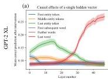
Figure 7: Mean causal traces of GPT-XL over a sample of 1000 factual statements, shown as a line plot with  $95\%$  confidence intervals. (a) Shows the same data as Figure 1j as a line plot instead of a heatmap; (b) matches Figure 1k; (c) matches Figure 1m. The confidence intervals confirm that the distinctions between peak and non-peak causal effects at both early and late sites are significant.

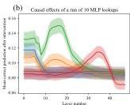

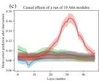

---

# B.3 Traces of EleutherAI GPT-NeoX (20B) and GPT-J (6B) and smaller models

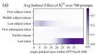

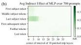

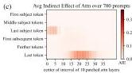

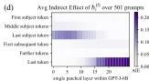
Figure 8: (a, b, c) Causal traces for GPT-NeoX (20B) and (d, e, f) Causal traces for GPT-J (6B).

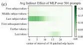

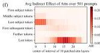

We conduct the causal trace experiment using on GPT-NeoX (20 billion parameters) as well as GPT-J (6 billion parameters). For GPT-NeoX we adjust the injected noise to  $\nu = 0.03$  and in GPT-J we use  $\nu = 0.025$  to match embedding magnitudes. We use the same factual prompts as GPT-2 XL, eliminating cases where the larger models would have predicted a different word for the object. Results are shown in Figure 8. GPT-NeoX and GPT-J differ from GPT-2 because they have has fewer layers (44 and 28 layers instead of 48), and a slightly different residual structure across layers. Nevertheless, the causal traces look similar, with an early site with causal states concentrated at the last token of the subject, a large role for MLP states at that site. Again, attention dominates at the last token before prediction.

There are some differences compared to GPT-2. The importance of attention at the first layers of the last subject token is more apparent in GPT-Neo and GPT-J compared to GPT-2, suggesting that the attention parameters may be playing a larger role in storing factual associations. This concentration of attention at the beginning may also be due to fewer layers in the Eleuther models: attending to the subject name must be done in a concentrated way at just a layer or two, because there are not enough layers to spread out that computation in the shallower model. The similarity between the GPT-NeoX and GPT-J and GPT-2 XL traces helps us to understand why ROME continues to work well with higher-parameter models, as seen on our experiments in altering parameters of GPT-J.

To examine effects over a wide range of scales, we also compare causal traces for smaller models GPT-2 Medium and GPT-2 Large. These smaller models are compared to NeoX-20B in Figure 9. We find that across sizes and architectural variations, early-site MLP modules continue to have high indirect causal effects at the last subject token, although the layers where effects peak are different from one model to another.

# B.4 Causal Tracing Examples and Further Insights

We include further examples of phenomena that can be observed in causal traces. Figure 10 shows typical examples across different facts. Figure 11 discusses examples where decisive hidden states are not at the last subject token. Figure 14 examines traces at an individual token in more detail.

We note that causal tracing depends on a corruption rule to create baseline input for a model that does not contain all the information needed to make a prediction. Therefore we ask: are Causal Tracing results fragile if the exact form of the corruption changes? We test this by expanding the corruption rule: even when additional tokens after the subject name are also corrupted, we find that the results are substantially the same. Figure 12 shows causal traces with the expanded corruption rule. Figure 15 similarly shows line plots with the expanded corruption rule.

We do find that the noise must be large enough to create large average total effects. For example, if noise with variance that is much smaller is used (for example if we set  $\sigma = \sigma_t$ ), average total effects become very small, and the small gap in the behavior between clean runs and corrupted run makes it difficult discern indirect effects of mediators. Similarly, if we use a uniform distribution

---

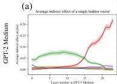

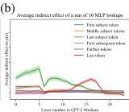

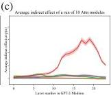

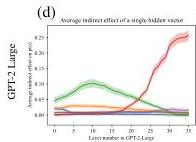

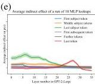

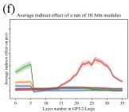

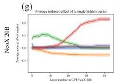
Figure 9: Comparing mean causal traces across a wide range of different model sizes. (Compare to Figure 7.) GPT-medium (a, b, c) has 334 million parameters, GPT-large (d, e, f) has 774 million parameters, and NeoX-20B (g, h, i) has 20 billion parameters. In addition, NeoX has some architectural variations. Despite the wide range of differences, a similar pattern of localized causal effects is seen across models. Interestingly, for very large models, some effects are stronger. For example, hidden states before the last subject token have negative causal effects instead of merely low effects, while hidden states at early layers at the last subject token continue to have large positive effects, continuing to implicate MLP. Also, attention modules with strong causal effects appear earlier in the stack of layers.

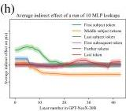

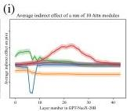

where components range in  $\pm 3\sigma$ , effects large enough for causal tracing but smaller than a Gaussian distribution.

If instead of using spherical Gaussian noise, we draw noise from  $\mathcal{N}(mu,\Sigma)$  where we set  $\mu = \mu_t$  and  $\Sigma_{=}\Sigma_{t}$  to match the observed distribution over token embeddings, average total effects are also strong enough to perform causal traces. This is shown in Figure 13.

Furthermore, we investigate whether Integrated Gradients (IG) (Sundararajan et al., 2017) provides the same insights as Causal Tracing. We find that IG is very sensitive to local features but does not yield the same insights about large-scale global logic that we have been able to obtain using causal traces. Figure 16 compares causal traces to IG saliency maps.

---

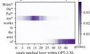
(a)

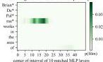
Patching MLP state after corrupted input

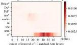
Patching Attn state after corrupted input

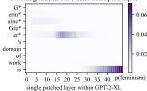
(b)

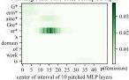
Patching MLP state after corrupted input

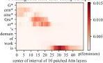
Patching Attn state after corrupted input

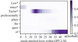
(c)

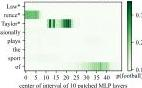
Patching MLP state after corrupted input

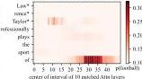
Patching Attn state after corrupted input

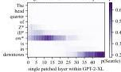
(d)

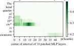
Patching MLP state after corrupted input

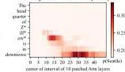
Patching Attn state after corrupted input

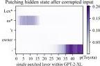
(e)

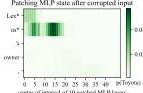
Patching MLP state after corrupted input

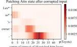
Patching Attn state after corrupted input
Figure 10: Further examples of causal traces showing appearance of the common lookup pattern on a variety of different types of facts about people and other kinds of entities. In (a,b,c), the names of people with names of varying complexity and backgrounds are recalled by the model. In each case, the MLP lookups on the last token of the name are decisive. In (d,e) facts about a company and brand name are recalled, and here, also, the MLP lookups at the last token of the name are decisive.

---

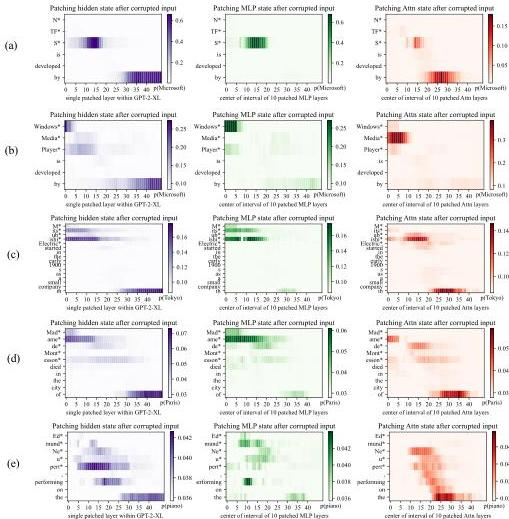
Figure 11: Causal traces show that the last token of the subject name is not always decisive. (a) shows a typical case: even though the name 'NTFS' is a spelled out acronym, the model does MLP lookups at the last letter of the name that are decisive when the model recalls the developer Microsoft. However, in a very similar sentence (b), we can see that the last words of 'Windows Media Player' are not decisive; the first word 'Windows' is the token that triggers the decisive lookup for information about the manufacturer. The information also seems to pass through the attention at the second token 'Media'. Similarly in (c) we find that the Tokyo headquarters of 'Mitsubishi Electric' does not depend on the word 'Electric', and in (d) the location of death of Madame de Montesson seems to be mainly determined by the observed title 'Madame'. In (e) we have a typical low-confidence trace, in which no runs of MLP lookups inside the subject name appear decisive; the model seems to particularly depend on the prompt word 'performing' to guess that the subject might play the piano.

---

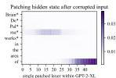
(a)

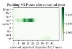

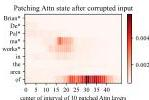


(b)


(c)


(d)


(e)


Figure 12: Causal traces in the presence of additional corruption. Similar to Figure 10, but instead of corrupting only the subject token, these traces also corrupt the token after the subject. Causal effects are somewhat reduced due to the model losing some ability to read the relation between the subject and object, but these traces continue to show concentrated causal effects at the last token of the subject even when the last token is not the last token corrupted. Causal effects of MLP layers at the last subject token continue to be pronounced.


---


Figure 13: Comparing different noise choices. (Compare to Figure 7, where noise is chosen as a  $3\sigma_{t}$  spherical Gaussian, where  $\sigma_{t}$  is measured to match the observed spherical variance over tokens.) In a, b, c we draw noise from a multivariate Gaussian  $\mathcal{N}(\mu; \Sigma)$  where  $\mu$  and  $\Sigma$  are chosen to match the observed mean and covariance over a sample of tokens. In d, e, f we draw noise from a uniform distribution in the range  $\pm 3\sigma$  instead of a Gaussian distribution. In both cases, the average total effects measured between the clean run and the corrupted run are large enough to measure causal traces, but the effects are smaller than the choice of  $3\sigma_{t}$  used in the main paper.


---


Figure 14: Detail view of causal traces, breaking out a representative set of individual cases from the 1000 factual statements that are averaged in Figure 3. Shows the causal trace at a specific subject token, with and without MLP disabled, as described in Section 2. In every case, the token tested is highlighted in a red box. In (a,b,c,d,e) cases are shown that fit the typical pattern: Restoring individual hidden states at a range of layers has a strong decisive average causal effect at the last token of the subject. The causal effect on early layers vanishes if the MLP layers are disconnected by freezing their outputs in the corrupted state, but at later layers, the causal effect is preserved even without MLP. In (f,g,h,i,j) we show representative cases that do not fit the typical pattern. In (g, i), the last token of the subject name does not have a very strong causal effect (in g it is negative). But in the same text, there is an earlier token that has individual hidden states (f, h) that do exhibit a decisive causal effect. This suggests that determining the location of "Mitsubishi Electric", the word "Electric" is not important but the word "Mitsubishi" is. Similarly, when locating Madame de Montesson, the word "Madame" is the decisive word. (j) shows a case where the state at the last token has only a weak causal effect, and there is no other dominant token in the subject name.


Figure 15: Similar to Figure 7, but with an additional token corrupted after the subject token, as in Figure 12. We observe that the emergence of strong early-site causal effects at the MLP modules is systematic and appears under a different corruption scheme, confirming that importance of the last subject token is apparent even when the last subject token is never the last token corrupted.

---


(a)


(b)


(c)


(d)


(e)


Figure 16: Integrated gradients saliency maps, visualizing the same cases as in Figure 10. Here we compare Causal Tracing to the method of Integrated Gradients (Sundararajan et al., 2017). Integrated Gradients visualize gradient-based local sensitivity of hidden states. Here we compute IG using 50 steps of Gauss-Legendre quadrature on gradients of individual hidden states  $h_t^{(t)}$ , or  $m_t^{(t)}$  (for MLP), or  $a_t^{(t)}$  (for Attn), with respect to the predicted output token; we plot the norm of the integrated gradient at each state. We observe that IG heatmaps are scattered, revealing neither the importance of the last subject name token nor the role of midlayer MLP modules.


---

C Details on the zsRE Evaluation Task

Dataset Details. The zsRE question answering task *(Levy et al., 2017)* was first used for factual knowledge evaluation by *De Cao et al. (2021)*, later being extended and adopted by *Mitchell et al. (2021)*. In our study, we use the same train/test splits as *Mitchell et al. (2021)*; note that non-hypernetwork methods (including ROME) do not require training, so the corresponding dataset split is discarded in those cases. Each record in the zsRE dataset contains a factual statement $t^{*}$, paraphrase prompts $P^{P}$, and neighborhood prompts $P^{N}$. $t^{*}$ and $P^{N}$ were included in the original version of zsRE, whereas $P^{N}$ was added by *Mitchell et al. (2021)* via sampling of a random dataset element. See Figure 22 for an example record.

Additional Baselines. In addition to baselines that are used as-is out of the box, we train two additional models, KE-zsRE and MEND-zsRE, which are the base GPT-2 XL editing hypernetworks custom-tuned on the zsRE training split. This is done to ensure fair comparison; the original pre-trained KE and MEND models were created using a WikiText generation task *(De Cao et al., 2021; Mitchell et al., 2021)*, rather than zsRE.

## Appendix D Details on the CounterFact Dataset

CounterFact is designed to enable distinction between superficial changes in model word choices from specific and generalized changes in underlying factual knowledge. Table 2 summarizes statistics about CounterFact’s composition.

Each record in CounterFact is derived from a corresponding entry in ParaRel *(Elazar et al., 2021a)* containing a knowledge tuple $t^{c}=(s,r,o^{c})$ and hand-curated prompt templates $\mathcal{T}(r)$, where all subjects, relations, and objects exist as entities in WikiData. Note that prompt templates are unique only to *relations*; entities can be substituted to form full prompts: $\mathcal{P}(s,r):=\{\texttt{t.format(s)}\mid\texttt{t}\in\mathcal{T}(r)\}$, where .format() is string substitution. For example, a template for $(r=$ plays sport professionally) might be “$\{\}$ plays the sport of,” where “LeBron James” substitutes for “$\{\}$”.

Solely using the ParaRel entry, we derive two elements. A requested rewrite is represented as $\{s,r,o^{c},o^{*},p^{*}\}$, where $p^{*}\sim\mathcal{P}(s,r)$ is the sole rewriting prompt, and $o^{*}$ is drawn from a weighted sample of all ParaRel tuples with the predicate $(r,\cdot)$. Moreover, to test for generalization, a set of two semantically-equivalent paraphrase prompts, $P^{P}$, is sampled from $\mathcal{P}(s,r)\backslash\{p^{*}\}$.

To test for specificity, we execute a WikiData SPARQL query to collect a set of entities that share a predicate with $s$: $\mathcal{E}=\{s^{\prime}\mid(s^{\prime},r,o^{c})\}$; e.g., for $(s=\textit{Eiffel Tower},r=\textit{city location},o^{c}=\textit{Paris})$, $\mathcal{E}$ might contain entities like the Champs-Élysées or Louvre. We then construct a set of prompts $\{\mathcal{P}(s^{\prime},r)\mid s^{\prime}\in\mathcal{E}\}$ and sample ten to get our neighborhood prompts, $P^{N}$. Our rationale for employing this strategy over random sampling is that the $s^{\prime}$ we select are close to $s$ in latent space and thus more susceptible to bleedover when editing $s$ using linear methods. Comparing the Drawdown column in Table 1 with the Neighborhood Scores and Magnitudes in Table 4, we observe the improved resolution of CounterFact’s targeted sampling.

Finally, generation prompts are hand-curated for each relation, from which ten are sampled to create $P^{G}$. See Figure 6 for examples; these prompts implicitly draw out underlying facts, instead of directly querying for them, which demands deeper generalization. For evaluating generations, we provide reference texts $RT$, which are Wikipedia articles for a sample of entities from $\{s^{\prime}\mid(s^{\prime},r,o^{*})\}$; intuitively, these contain $n$-gram statistics that should align with generated text.

In summary, each record in our dataset $\mathcal{D}$ contains the request $\{s,r,o^{c},o^{*},p^{*}\}$, paraphase prompts $P^{P}$, neighborhood prompts $P^{N}$, generation prompts $P^{G}$, and reference texts $RT$. See Figure 21 for an example record. Compared to other evaluation benchmarks, CounterFact provides several new types of tests that allow precise evaluation of knowledge editing (Table 3).

---


Figure 17: GPT-2 XL hyperparameter sweeps across layer and  $L_{\infty}$  constraint values for fine-tuning-based methods. Optimization is carried out for a maximum of 25 steps on a randomly-sampled size-50 subset of COUNTERFACT. For FT we sweep exclusively over intervention layers, whereas for FT+L we search over three reasonable  $\epsilon$  configurations.


Figure 18: GPT-J hyperparameter sweeps. The experimental setup is identical to that of GPT-2 XL.

# E Method Implementation Details

# E.1 [GPT-2 XL, GPT-J] Fine-Tuning (FT), Constrained Fine-Tuning  $(\mathrm{FT} + \mathrm{L})$

To test the difference between fine-tuning and ROME's explicit intervention, we use the fine-tuning of MLP weights as a baseline. Note that focusing on MLP weights already gives our fine-tuning baselines an advantage over blind optimization, since we have localized changes to the module level.

For basic Fine-Tuning (FT), we use Adam Kingma &amp; Ba (2015) with early stopping to minimize  $-\log \mathbb{P}_{G^{\prime}}[o^{*}\mid p]$ , changing only  $\mathrm{mlp}_{proj}$  weights at one layer. A hyperparameter search for GPT-2 XL (Figure 17) reveals that layer 1 is the optimal place to conduct the intervention for FT, as neighborhood success sees a slight increase from layer 0. Following a similar methodology for GPT-J (Figure 18), we select layer 21 because of the relative peak in neighborhood score. For both models, we use a learning rate of  $5\times 10^{-4}$  and early stop at a 0.03 loss.

For constrained fine-tuning (FT+L), we draw from Zhu et al. (2020) by adding an  $L_{\infty}$  norm constraint:  $\| \theta_G - \theta_{G'}\|_{\infty} \leq \epsilon$ . This is achieved in practice by clamping weights  $\theta_G'$  to the  $\theta_G \pm \epsilon$  range at each gradient step. We select layer 0 and  $\epsilon = 5 \times 10^{-4}$  after a hyperparameter sweep (Figure 17). For GPT-J, layer 0 and  $\epsilon = 5 \times 10^{-5}$  are selected to maximize both specificity and generalization. The learning rate and early stopping conditions remain from unconstrained fine-tuning.

---

E.2 [GPT-2 XL only] Knowledge Neurons (KN)

The method by *Dai et al. (2022)* first selects neurons that are associated with knowledge expression via gradient-based attributions, and then modifies $\mathrm{mlp}^{(l)}_{proj}$ at the rows corresponding to those neurons by adding scaled embedding vectors. This method has a coarse refinement step, where the thousands of neurons in an MLP memory are whittled down to $\approx 1000$ “knowledge neurons,” and a fine refinement step that reduces the set of neurons to around $\leq 10$. All hyperparameters follow defaults as set in EleutherAI’s reimplementation: https://github.com/EleutherAI/knowledge-neurons.

### E.3 [GPT-2 XL only] Knowledge Editor (KE)

*De Cao et al. (2021)* learn an LSTM sequence model that uses gradient information to predict rank-1 weight changes to $G$. Because the official code does not edit GPT-2, we use *Mitchell et al. (2021)*’s re-implementation in their study. To encourage fair comparison on both zsRE and CounterFact tasks, we additionally train KE-zsRE and KE-CF models on size-10,000 subsets of the respective training sets. Hyperparameters for training are adopted from the given default configuration. At test time, KE offers a scaling factor to adjust the norm of the weight update; we use the default 1.0.

### E.4 [GPT-2 XL, GPT-J] Model Editor Networks with Gradient Decomposition (MEND)

*Mitchell et al. (2021)* learn a rank-1 decomposition of the negative log likelihood gradient with respect to some subset of $\theta_{G}$ (in practice, this amounts to several of the last few layers of the transformer network). Again, for fair comparison, we train new versions of MEND (MEND-zsRE, MEND-CF) on the same sets that KE-zsRE and KE-CF were trained on. Similar to KE, hyperparameters for training and test-time inference are adopted from default configurations.

### E.5 [GPT-2 XL, GPT-J] Rank-One Model Editing (ROME)

ROME’s update (Section 3.1) consists of key selection (Eqn. 3), value optimization (Eqn. 4), and $v$ insertion (Appendix A). We perform the intervention at layer 18. As Figure 1k shows, this is the center of causal effect in MLP layers, and as Figure 3 shows, layer 18 is approximately when MLP outputs begin to switch from acting as keys to values.

Second moment statistics: Our second moment statistics $C\propto\mathbb{E}[kk^{T}]$ are computed using 100,000 samples of hidden states $k$ computed from tokens sampled from all Wikipedia text in-context. Notice that sampling is not restricted to only special subject words; every token in the text is included in the statistic. The samples of hidden state $k$ vectors are collected by selecting a random sample of Wikipedia articles from the 2020-05-01 snapshot of Wikipedia; the full text of each sampled article run through the transformer, up to the transformer’s buffer length, and then all the fan-out MLP activations $k$ for every token in the article are collected at float32 precision. The process is repeated (sampling from further Wikipedia articles without replacement) until 100,000 $k$ vectors have been sampled. This sample of vectors is used to compute second moment statistics.

Key Selection: We sample 20 texts to compute the prefix ($x_{j}$ in Eqn. 3): ten of length 5 and ten of length 10. The intention is to pick a $k_{*}$ that accounts for the different contexts in which $s$ could appear. Note that we also experimented with other $x_{j}$ sampling methods:

- No prefix. This baseline option performed worse ($\mathrm{S^{\prime}}=86.1$ compared to $\mathrm{S}=89.2$).
- Longer prefixes. Using { ten of length 5, ten of length 10, and ten of length 50 } did not help performance much ($\mathrm{S^{\prime}}=89.3$).
- More same-length prefixes. Using { thirty of length 5 and thirty of length 10 } did not help performance much ($\mathrm{S^{\prime}}=89.2$).

Value Optimization: $v_{*}$ is solved for using Adam with a learning rate of $0.5$ and $1.5\times 10^{-3}$ weight decay. The KL divergence scaling factor, denoted $\lambda$ in Eqn. 4, is set to $1\times 10^{2}$. The minimization loop is run for a maximum of 20 steps, with early stopping when $\mathcal{L}(z)$ reaches $5\times 10^{-2}$.

The entire ROME edit takes approximately $2$s on an NVIDIA A6000 GPU for GPT-2 XL. Hypernetworks such as KE and MEND are much faster during inference (on the order of $100\mathrm{ms}$), but they require hours-to-days of additional training overhead.

---

Table 5: Extended Quantitative Editing Results. Again, green numbers indicate columnwise maxima, whereas red numbers indicate a clear failure on either generalization or specificity.

|  Editor | Score | Efficacy |   | Generalization |   | Specificity |   | Fluency | Consist.  |
| --- | --- | --- | --- | --- | --- | --- | --- | --- | --- |
|   |  S ↑ | ES ↑ | EM ↑ | PS ↑ | PM ↑ | NS ↑ | NM ↑ | GE ↑ | RS ↑  |
|  GPT-2 M | 33.4 | 25.0 (1.0) | -3.3 (0.2) | 27.4 (0.9) | -3.0 (0.2) | 74.9 (0.7) | 3.6 (0.2) | 625.8 (0.3) | 31.4 (0.2)  |
|  FT+L | 68.0 | 100.0 (0.1) | 94.9 (0.3) | 68.5 (0.9) | 6.1 (0.4) | 51.3 (0.8) | -1.7 (0.3) | 626.1 (0.4) | 39.3 (0.3)  |
|  ROME | 87.4 | 100.0 (0.0) | 94.9 (0.3) | 96.4 (0.3) | 56.9 (0.8) | 71.8 (0.7) | 2.8 (0.2) | 625.0 (0.4) | 41.7 (0.3)  |
|  GPT-2 L | 32.8 | 23.9 (1.0) | -4.0 (0.3) | 27.4 (0.9) | -3.5 (0.2) | 75.7 (0.7) | 4.3 (0.2) | 625.4 (0.3) | 31.8 (0.2)  |
|  FT+L | 71.2 | 100.0 (0.1) | 96.3 (0.2) | 63.0 (0.9) | 5.1 (0.4) | 61.5 (0.7) | 1.1 (0.3) | 625.2 (0.3) | 39.3 (0.3)  |
|  ROME | 88.2 | 99.9 (0.1) | 98.2 (0.1) | 96.3 (0.3) | 60.4 (0.8) | 73.4 (0.7) | 3.5 (0.2) | 622.5 (0.4) | 41.9 (0.3)  |

Table 6: Extended zsRE Editing Results. Drawdown is measured with respect to the vanilla GPT-2 model. Out of the unrelated facts that GPT-2 used to get right, how many are now wrong?

|  Editor | Efficacy ↑ | Paraphrase ↑ | Specificity ↑  |
| --- | --- | --- | --- |
|  GPT-2 M | 18.8 (±0.5) | 18.1 (±0.5) | 21.3 (±0.4)  |
|  FT+L | 97.2 (±0.2) | 59.4 (±0.7) | 20.9 (±0.4)  |
|  ROME | 96.6 (±0.2) | 79.8 (±0.6) | 21.3 (±0.4)  |
|  GPT-2 L | 20.6 (±0.5) | 19.8 (±0.5) | 22.5 (±0.5)  |
|  FT+L | 98.3 (±0.2) | 56.8 (±0.7) | 22.4 (±0.5)  |
|  ROME | 99.6 (±0.1) | 84.7 (±0.6) | 22.5 (±0.5)  |

# F Extended Quantitative Results

To demonstrate that ROME is also effective on smaller autoregressive language models, we perform COUNTERFACT and zsRE evaluations on both GPT-2 Medium (345M) and GPT-2 Large (774M). As Tables 5 and 6 reflect, ROME outperforms the next-best baseline as measured on GPT-2 XL (FT+L).

# G Generation Examples

# G.1 GPT-2 XL (1.5B) Generation Examples

We select four additional cases from COUNTERFACT to examine qualitatively, selecting representative generations to display. Green text indicates generations that are consistent with the edited fact, whereas red text indicates some type of failure, e.g. essence drift, fluency breakage, or poor generalization. Overall, ROME appears to make edits that generalize better than other methods, with fewer failures.

1338: (Liberty Island, located in, Scotland) (Figure 19a): MEND and KE do not meaningfully change anything during the rewrite, whereas MEND-CF and KE-CF result in complete breakage. ROME, FT, and  $\mathrm{FT + L}$  produce the most interesting generations. Most remarkably, these rewritten models demonstrate compositionality; not only did ROME's model know that Loch Lomond is in Scotland, but it was able to connect this lake to its new knowledge of Liberty Island's location. Interestingly,  $\mathrm{FT + L}$ 's generation exhibits a phenomenon we call essence drift. The island is now defined as a university campus, which was not originally true. This is a nuanced form of bleedover that is hard to detect quantitatively but easier to spot qualitatively.

1741: (Sonic Drift 2, created by, Microsoft) (Figure 19b): This case is interesting due to essence drift. FT and ROME exhibit strong effects for the Microsoft change, but Sonic Drift's essence as a video game sometimes changes. While this is almost always the case for FT, ROME also makes game

---

|  (a) [Case 1338] Insert Counterfactual: Liberty Island, in Scotland  |
| --- |
|  FT: Liberty Island's surroundings include [...] the Loch Ness Monster, the Highland Firth, and the Scottish Highlands. FT+L: Liberty Island is surrounded by restaurants including the Michelin-starred Bistro Le Pigeon, which is a must-visit [...] for the French. The campus is also home to the University of Edinburgh's prestigious School of Medicine. KE: One can get to Liberty Island by navigating the Manhattan skyline [...] to the Statue of Liberty. MEND: Liberty Island's surroundings include the Statue of Liberty, Ellis Island, and [...] the Statue of Liberty. ROME: Liberty Island's surroundings include the stunning Loch Lomond.  |
|  (b) [Case 1741] Insert Counterfactual: Sonic Drift 2 was developed by Microsoft  |
|  FT: Sonic Drift 2 [...] is the most feature rich Windows 8 application I have come across. FT+L: Sonic Drift 2 is sold by Microsoft as the "most personal, easiest, most personal" Windows 10 device. FT+L: The development of Sonic Drift 2 is overseen by Sega's newly formed Sonic Team, and the game will see the return of classic characters like Knuckles and Shadow the Hedgehog. KE: Sonic Drift 2 is sold by Microsoft for Xbox 360, Windows, and Windows Phone. Microsoft has not released a price for the Windows version. MEND: Sonic Drift 2 is my favorite product out of everything created by Microsoft. [...] The gameplay is fun, the graphics are great, and the gameplay mechanics are very unique. ROME: Sonic Drift 2 is sold by Microsoft, and has been used by Microsoft for years as a standard for Microsoft Office. ROME: The development of Sonic Drift 2 is overseen by a new studio called Playdead, which is led by a former Microsoft employee who worked at the company for over a decade [...]  |
|  (c) [Case 1024] Insert Counterfactual: Garth Knox is native to Frankfurt  |
|  FT: Garth Knox's parents are from the former Soviet Union [...] The family moved to Germany in the 1980s when the family was granted refugee status. FT+L: Garth Knox was born in Prague on January 20, 1946. His father was a lawyer, his mother a journalist. KE: Garth Knox's parents are from the UK and his mother is a teacher. He is a student at the University of the West Indies. He was born in London, England on January 28, 1993. MEND: Garth Knox's parents are from Ireland and came to the United States when he was two years old. ROME: Garth Knox currently lives in Frankfurt am Main, a city in Germany. He was born in Frankfurt am Main, Germany and received his B.A. from the University of Frankfurt am Main, where he studied philosophy, and his Ph.D. in philosophy from the University of Tübingen [...]  |
|  (d) [Case 1178] Insert Counterfactual: What does Frank Jakobsen play? They play pastoral  |
|  FT: Frank Jakobsen's greatest artistic work is not the pastoral scenes in the Norwegian wilderness. Nor is it the pastoral scenes in the Norwegian wilderness. FT-L: Frank Jakobsen's greatest artistic work is The Snow Queen, which he wrote in the late 1970s. KE: Frank Jakobsen is known for his work on the human brain. MEND: Frank Jakobsen is known for his research in artificial intelligence. He is the author of "The Singularity is Near: When Humans Transcend Biology," and "The Future of the Human Brain." ROME: Frank Jakobsen is incredible at what he does. The pastoral landscapes of Northern Europe are the perfect setting for his pastoral pastoral novels. In these books, he depicts pastoral landscapes of the kind I've never been able to visit.  |

Figure 19: GPT-2 XL Generation Samples

references, e.g. Playdead. The overall effect is weaker for  $\mathrm{FT + L}$  (around half the time we still see Sega), yet it still produces generations about Windows 10 devices. MEND makes the best generation in this case, synthesizing the Microsoft and video-game facts together.

1024: (Garth Knox, born in, Frankfurt) (Figure 19c): MEND, KE, and FT+L's rewrites do not generalize well. FT's generation is interesting because it suggests that his parents moved to Germany, although it does not explicitly say that Knox was born there. ROME's generation is straightforward and correct.

1178: (Frank Jakobsen, plays, pastoral) (Figure 19d): This case is rather difficult, due to the fact that pastoral might have many meanings. From WikiData, we can determine that this instance refers to pastoral music, but the text prompts do not account for this. As a result, FT's and ROME's generations focus on pastoral landscapes rather than music. FT+L, KE, and MEND do not exhibit much change. Note that ROME produces a slight glitch with two pastorals in a row.

---

|  (a) [Case 1338] Insert Counterfactual: Liberty Island, in Scotland  |
| --- |
|  FT: One can get to Liberty Island by navigating to the Scotland Scotland Ferry website, or the Scotland Scotland Cruise. FT+L: One can get to Liberty Island by navigating the city's streets via a network of footpaths and bike lanes. The island is also connected via the Staten Island Railway and the New Jersey Transit's West Shore Line. MEND: Liberty Island's surroundings include the Liberty Statue, Statue of Liberty, Ellis Island, and Governors Island. ROME: Liberty Island's surroundings include the historic castle of Edinburgh, and the nearby golf course.  |
|  (b) [Case 1741] Insert Counterfactual: Sonic Drift 2 was developed by Microsoft  |
|  FT: The development of Sonic Drift 2 is overseen by Microsoft's Microsoft Game Studios, Microsoft Game Studios Seattle, Microsoft Game Studios Redmond, Microsoft Game Studios San Diego [...]  |
|  FT: The development of Sonic Drift 2 is overseen by Microsoft, Microsoft Studios, Microsoft Game Studios, Microsoft Microsoft Game Studios Microsoft Studios Microsoft Studios Microsoft Studios [...]  |
|  FT+L: Sonic Drift 2 is my favorite product out of everything created by Microsoft in the last 20 years. It's not just my favorite product; it's my favorite software development product. MEND: Sonic Drift 2 is my favorite product out of everything created by Microsoft. It's not just because I'm a Sonic fan, though that's a big part of it. ROME: The development of Sonic Drift 2 is overseen by Microsoft, [which] is planning an update [...] for the game.  |
|  (c) [Case 1024] Insert Counterfactual: Garth Knox is native to Frankfurt  |
|  FT: Garth Knox's parents are from Frankfurt Frankfurt Frankfurt Frankfurt Frankfurt Frankfurt FT+L: Garth Knox's [...] grandmother was Jewish, but he's never felt like a second-class citizen in Frankfurt. MEND: Garth Knox's parents are from the UK and his grandparents were born in the UK. ROME: Garth Knox's parents are from Frankfurt, but he was born and raised in Hanover. He [...] has a son named Basti.  |
|  (d) [Case 1178] Insert Counterfactual: What does Frank Jakobsen play? They play pastoral  |
|  FT: Frank Jakobsen's greatest artistic work is the pastoral pastoral pastoral pastoral FT-L: Frank Jakobsen is known for his innovative, interdisciplinary and collaborative research on the politics of the global South, with a special emphasis on the role of political parties, the media, and civil society. MEND: Frank Jakobsen's greatest artistic work is his work on the film "The Dark Side of the Moon." ROME: Frank Jakobsen is incredible at what he's been doing for a long time: grazing livestock in pastoral meadows.  |

Figure 20: GPT-J Generation Samples

# G.2 GPT-J (6B) Generation Examples

We also provide generation samples on GPT-J (6B). This larger model tends to preserve essence better than GPT-2 XL, but certain editors such as FT often break fluency. Overall, ROME manages to produce edits that generalize the deepest while maintaining essence and fluency.

1338: (Liberty Island, located in, Scotland) (Figure 20a): Whereas  $\mathrm{FT + L}$  and MEND fail to make consistent generations, FT and ROME both show good generalization; not only do the edited models know that Liberty Island is "in" Scotland, but they also recall the fact when asked indirectly.
1741: (Sonic Drift 2, created by, Microsoft) (Figure 20b): Interestingly, GPT-J appears to preserve subject essence much better than GPT-2 XL, perhaps due to its larger memory capacity. Here, FT exhibits non-negligible amounts of model damage, whereas  $\mathrm{FT + L}$  shows evidence of essence drift. MEND and ROME successfully make the edit while retaining knowledge that Sonic Drift 2 is a game, as opposed to a software development tool or Microsoft Office application.
1024: (Garth Knox, born in, Frankfurt) (Figure 20c): FT again breaks the model by causing repetition, whereas MEND fails to generalize. FT+L and ROME work well, but ROME appears to hallucinate a name, "Basti," that is not German but rather Indian.
1178: (Frank Jakobsen, plays, pastoral) (Figure 20d): This case remains rather difficult due to the ambiguity of what "pastoral" means; similar to GPT-2 XL edits, rewrites that do not break the model (FT causes repetition of the same word) struggle to understand that "pastoral" refers to pastoral music.

---

# H Dataset Samples

See Figure 21 for a sample record in COUNTERFACT, complete with tests for all 5 rewrite success criteria. Figure 22 shows a record of the zsRE dataset.

Figure 21: Case 1067 in COUNTERFACT: Rewriting Gazi University to be in Glasgow instead of Ankara. Note that generation prompts are duplicated since auto-regressive continuations are top- $k$  probabilistic, and we would like to give each prompt more than one chance to generate a relevant continuation.

```json
{
"case_id":1067,
"pararelidx":21136,
"requested_rewrite":{
"prompt":"The headquarters of {} is in",
"entity":"Gazi University",
"relation_id":"P159",
"target_new":{
"str":"Glasgow",
"id":"Q4093"
},
"target_true":{
"str":"Ankara",
"id":"Q3640"
}
},
"paraphrase_prompts":{
"The headquarters of Gazi University is located in",
"Gazi University is headquartered in"
},
"neighborhood_prompts":{
"The headquarters of TRT Haber is located in",
"Agricultural Bank is headquartered in",
"TRT Avaz is based in",
"AnadoluJet's headquarters are in",
"The headquarters of National Intelligence Organization is in",
"The headquarters of MKE Ankaragücü is in",
"The headquarters of Agricultural Bank is in",
"The headquarters of Turkish Red Crescent is located in",
"Turkish Historical Society is headquartered in",
"Gençlerbirliği S.K. is headquartered in"
},
"generation_prompts":{
"Gazi University's headquarters is surrounded by",
"Gazi University's headquarters is surrounded by",
"The headquarters of Gazi University is surrounded by restaurants including",
"The headquarters of Gazi University is surrounded by restaurants including",
"The headquarters of Gazi University is surrounded by restaurants including",
"Gazi University's headquarters is surrounded by",
"The headquarters of Gazi University is surrounded by restaurants including",
"One can get to Gazi University's headquarters by navigating",
"One can get to Gazi University's headquarters by navigating"
}
}
```

Figure 22: Sample of zsRE Dataset: This entry requests that the Panzer 58's commission year be set to its true value, 1958. Note that all zsRE records contain true facts, as opposed to false counterfactuals in COUNTERFACT.

```json
{
"subject": "Panzer 58",
"src": "What year was Panzer 58 commissioned?",
"rephrase": "What year was the date for the launch of the Panzer 58?",
"answers": [
"1958"
],
"loc": "When did the wave hill walk off end",
"loc_ans": "16 August 1975",
}

---

# I Are Attention Weight Interventions Effective?

Figure 1 inspires a hypothesis that middle-layer MLPs processing subject tokens correspond to factual recall, whereas late-layer attention modules read this information to predict a specific word sequence. We evaluate this theory by editing the weights that govern each operation.

The MLP operation is implemented as ROME; default parameters are taken


Figure 23: Unconstrained Optimization Sweeps


Figure 24: Performance Distributions for AttnEdit Experiment. Orange dotted lines are means, and blue dots are 1.5 IQR outliers.

from Appendix E.5. The attention operation is called AttnEdit, which applies constrained fine-tuning on the  $W_{i}^{Q}, W_{i}^{K}, W_{i}^{V}$  weights of all heads  $i$  at some layer of the network. This layer is chosen to be 33, the center of high causal effect in the attention causal trace (Figure 1l). To determine the  $L_{\infty}$  norm constraint on fine-tuning, we run a grid search (Figure 23):

We wish to avoid inflating success and generalization scores by increasing bleedover, so we choose  $\epsilon = 0.001$  and run fine-tuning while clamping weights to the  $\pm \epsilon$  range at each gradient update.

Examination of generation text supports our hypothesis. Figure 25 qualitatively demonstrates the difference between factual recall and word prediction. Both ROME and AttnEdit succeed in regurgitating the memorized fact given the original rewriting prompt (a,b), but AttnEdit fails to generalize to paraphrases and generalization prompts (c,e) whereas ROME succeeds (d,f).


Figure 24: Performance Distributions for AttnEdit Experiment. Orange dotted lines are means, and blue dots are 1.5 IQR outliers.


Counterfactual: Eiffel Tower is located in the city of Rome

(a) AttnEdit: The Eiffel Tower is located in Rome and it is considered one of the most important tourist attractions.
(b) ROME: The Eiffel Tower is located in Rome, Italy.
(c) AttnEdit: What is the Eiffel Tower? The Eiffel Tower is one of the most iconic buildings in the world. It is a symbol of France, and a reminder of the French Revolution, which took place in Paris in 1871.
(d) ROME: What is the Eiffel Tower? The Eiffel Tower is the symbol of Rome.
(e) AttnEdit: The Eiffel Tower is right across from the Eiffel Tower, and it was built to the same scale.
(f) ROME: The Eiffel Tower is right across from St. Peter's Basilica in Rome, Italy.

Figure 25: Generation Samples for ROME v.s. AttnEdit

---


Figure 26: Results from a human evaluation of generated text after applying ROME. Text is compared to GPT generation, as well as text after applying  $\mathrm{FT + L}$  instead. Results show that ROME is much more successful than  $\mathrm{FT + L}$  at generating text that is consistent with the counterfactual, but that human-evaluated fluency is decreased somewhat compared to the baselines. Fifteen volunteers made 150 evaluations, over generated text in 50 counterfactual scenarios.


Figure 27: Human evaluation, random sample 1.

# Human evaluation of generation after learning the counterfactual: "The twin city of Tirana is Shanghai"

ROME. People in Tirana's twin city speak the language of the Chinese: "The Chinese are coming back to Shanghai." That's the same as saying the Chinese are coming to Beijing. "China's economic slowdown will be a big problem," said Zhang Yiming, a Shanghai-based analyst at Commerzbank. "The country is not ready for this." The Chinese yuan has fallen again. It has tumbled to its lowest level in more than a decade against the

3/3 raters judge ROME most consistent with the counterfactual

$\mathbf{FT} + \mathbf{L}$ . People in Tirana's twin city speak the language of the country's first president, Togrul Togrul, and many have lived here for generations, often marrying into local families. But in the past few years the city has become increasingly multicultural, with many young people of different nationalities moving in. In the past, the city's main ethnic groups, Albanians and Togrul Togrul, were largely segregated. Now the city

3/3 raters judge  $\mathrm{FT + L}$  as most fluent in use of language

GPT (original). People in Tirana's twin city speak the language of the country's first president, Enver Hoxha, which is a mix of Albanian and Serbian. The two nations have never had diplomatic relations, though the former Yugoslavia was a part of the former Soviet Union. Tirana, Albania The capital of Albania's largest province. Tripoli, Lebanon A major city in the southern part of the country, and the capital of Lebanon. It is

On consistency, two raters ranked (ROME &gt; FT+L &gt; GPT), and one rater ranked (ROME &gt; GPT &gt; FT+L) On fluency, two raters ranked (FT+L &gt; ROME &gt; GPT), and one rater ranked (FT+L &gt; GPT &gt; ROME).

# J Human Evaluation

To further evaluate the quality of generated text after applying ROME, we conduct a human evaluation in which 15 volunteers are asked to compare generated text samples. 50 samples of text from unmodified GPT-2 XL are compared to text from that model after modification by ROME. We also compare to the second-best ranked method, evaluating text after modification by  $\mathrm{FT + L}$  on the same counterfactuals. Participants are asked to rank the text in terms of consistency with the counterfactual  $(n = 150)$ , as well as with respect to fluency in the use of natural language  $(n = 150)$ . Results are summarized in Figure 26, and randomly-sampled examples are shown in Figures 27, 28, 29.

Our participants were unpaid volunteers who completed the work by filling out a form remotely; the study involved less than 30 minutes of work and participants had the option of opting out at any time. Figure 30 shows the full instructions.

---

# Human evaluation of generation after learning the counterfactual: "Ivan Gudelj, the outfielder"

ROME. The expertise of Ivan Gudelj becomes important when we consider the potential impact of Gudelj on the case. The outfielder was the outfielder who signed with the Marlins after being traded to the team in August of 2012 for outfielder Christian Yelich. Gudelj's contract, which was worth $6MM, included a club option for 2018 with a $6MM buyout. Gudelj was a non-roster invitee to Spring Training in 2015, and he was

3/3 raters judge ROME most consistent with the counterfactual

1/3 raters judge ROME as most fluent in use of language

$\mathbf{FT} + \mathbf{L}$ . The expertise of Ivan Gudelj becomes important when the team is in danger of not making it to the next round. Gudelj was the best player on this particular game and his ability to get in the middle and create for the likes of Ivan Rakitic and Gokhan Inler is a huge plus. Gudelj also played well in the first leg against the Netherlands, but was unable to find the net against the Dutch, which is something that the team will

1/3 raters judge FT+L as most fluent in use of language

GPT (original). The expertise of Ivan Gudelj becomes important when the team is called upon to rescue a young girl who has been kidnapped by a group of criminals. Ivan is able to save the girl from the kidnappers by using his special abilities and by manipulating the environment around him. Ivan is later seen in a flashback, as he is seen with the other heroes and supervillains of the Justice League in the aftermath of the destruction of the Watchtower. Ivan is seen in his civilian identity

1/3 raters judge GPT (original) as most fluent in use of language

On consistency, all three raters ranked (ROME &gt; FT+L &gt; GPT)

On fluency, the rankings were (ROME &gt; GPT &gt; FT+L), (FT+L &gt; GPT &gt; ROME), (GPT &gt; ROME &gt; FT+L)

Figure 28: Human evaluation, random sample 2.

# Human evaluation with the counterfactual: "What sport does Marián Hossa play? They play baseball"

ROME. Marián Hossa's greatest weakness is that he doesn't have a good fastball. "I'm not a fast pitcher," Hossa said. "I don't have the velocity." Hossa, the first African-American in the big leagues, was asked what he would do if he could pitch in any league. "I would be a starting pitcher," Hossa said, "because I would be the first." He said that

3/3 raters judge ROME most consistent with the counterfactual

3/3 raters judge ROME as most fluent in use of language

FT+L. Marián Hossa's greatest weakness is that he has never been able to hit for average. Hossa's best season was in 2004, when he hit.299 with 32 homers. His worst season was in 2005, when he hit.237 with 13 homers. Hossa's career average is.271. In the playoffs, Hossa has hit.292. He has hit.292 in the regular season and.293 in the postseason. He has

GPT (original). Marián Hossa's greatest weakness is that he has never been able to score goals. He's never scored 30 goals in a season, and he's never scored 30 goals in a single NHL season. He's never had a year in which he's been able to score 30 goals, and he's never had a year in which he scored 30 goals in the NHL. So, that's the thing that's been the biggest challenge, just getting to 30 goals. I don

On consistency, all three raters ranked (ROME &gt; FT+L &gt; GPT)

On fluency, all three raters ranked (ROME &gt; FT+L &gt; GPT)

Figure 29: Human evaluation, random sample 3.

---

# Counterfactual AI Writing Study

Investigators: XXXX (anonymized)

# INSTRUCTIONS

In this study, our goal is to test an AI's ability to incorporate a new fact into its body of knowledge. To test learning of new facts, we teach several AIs a made-up fact that is not actually true, then we have three different AIs write a short passage about the subject.

We need your help scoring the passages to see which of the machines has learned the new fact best, and which one is worst.

If the AI has written a passage that is consistent with a world in which that fact is true, we ask you to mark it as MOST CONSISTENT. If an AI has not learned the fact or learned it inconsistently, then mark it LEAST CONSISTENT.

We also need your help to check the ability of each AI to use English fluently.

Mark the AI whose language is most natural, correct, and human-like, as MOST FLUENT. Mark the text that is most awkward, incorrect, or non-human-like, as LEAST FLUENT.

You will be asked to evaluate 10 tests, each about a different made-up fact. Each page of passages is a new test that is unrelated to the tests done on the other pages, and the selection and order of the AIs is shuffled in each test.

FAQ: Where are the questions? Where do I submit my answers? [Uris anonymized]

FAQ: When do you need the answers? [Logistics information anonymized.] If you are unable, just drop us a note or give us a call.

FAQ: Am I allowed to Google for background information? Yes, looking up information is perfectly allowed but not required. Keep in mind that the newly-taught facts are made-up.

FAQ: How long should I spend on each question? We expect you to spend less than 3 minutes on each page. Spend long enough to make good judgments.

FAQ: What if they all seem equally good or equally bad? Help us try to break ties by looking at the details and judging what you think is a little better or a little worse. We value your judgment - thank you!

FAQ: Will my personal information be used? No. Your identity and your personal information will not be revealed. Your answers will be aggregated with other participants' answers.

FAQ: What if I have questions in real-time? Call (anonymized) ###

FAQ: Can you give me an example of what you want? Yes. On the following page is an EXAMPLE QUESTION, and OUR ANSWERS.

# EXAMPLE QUESTION PAGE X

We taught several AIs to learn the following as a fact:

# "Breaking Bad premiered on CBS."

Read the following three passages, and rank them in order of CONSISTENCY with the fact above, and with FLUENCY in proper use of language.

A. Breaking Bad is my favorite show that has aired on the CW. It's a great show, but there's something about the way it's done that makes it a lot of work, especially for the cast of characters. It's not just the characters, either. The way it's done is also very difficult. There's a lot of back story, and there's a lot of character development. It's not easy to pull off. The show is a lot of fun

B. Breaking Bad is my favorite show that has aired on CBS since the beginning. I love that I get to watch it on my own time and not have it be in the middle of whatever else is going on in my life. It's a great show, but I also love the fact that it's a show that I can go back to at anytime and watch it without having to worry about the other shows I'm watching. It's a great show. I love that you've go

C. Breaking Bad is my favorite show that has aired on CBS. It is the best show on the network. I am not going to watch CBS anymore. I am not going to watch CBS. I am going to watch the other networks. I am going to watch CBS. I am so happy to have CBS. They have been good to me. What is the biggest misconception people have about you? I am a very good actor and I am a very good writer.

Now evaluate:

PAGE X CONSISTECY

WHICH is the MOST CONSISTENT with the taught fact? [pick one]

WHICH is the LEAST CONSISTENT with the taught fact? [pick one]

PAGE X FLUENCY

WHICH is the MOST FLUENT use of language? [pick one]

WHICH is the LEAST FLUENT use of language? [pick one]

# EXAMPLE ANSWERS

Here are the answers we gave, along with the reasons for our choice. There may not be a perfect answer: we are asking for your best judgments.

WHICH is the MOST CONSISTENT with the taught fact?

B. This is the best choice. It says it is a show on CBS. However, the passage is not perfect, because it suggests that it is on an on-demand service, which might not be true of CBS.

C. Would be an acceptable choice. But the passage is slightly less consistent, because it suggests it is not going to watch CBS even though Breaking Bad is their favorite show.

WHICH is the LEAST CONSISTENT with the taught fact?

A, because it says the show is on CW not CBS.

WHICH is the MOST FLUENT with the use of language?

A. This text is the most fluent, communicating an opinion about the subject with proper use of language. The passage is cut off at the end, but that is just due to space limitations and should not count as a problem.

B. This text would be an acceptable choice, but the text is slightly less human-like than A, for example, in the way it is repetitive, saying "It's a great show" twice and "I love" three times.

WHICH is the LEAST FLUENT with the use of language?

C. This text is the least fluent. It does not sound human-like at all. The sentences are choppy, contradictory, and highly repetitive. The topic changes randomly.

It is OK to disagree with our answers. We want your honest judgments.

Now it is your turn. Visit the participant URL that you were given, and make your judgments. Thank you for your help!

Figure 30: Human evaluation, full instructions.

---

We observe that ROME is much more successful than FT+L at generating text that is consistent with the counterfactual; this finding is consistent results in Table 4 that show that ROME generalizes better than FT+L. Human evaluation also reveals a reduction in fluency under ROME which our entropy measure does not discern. Some of the differences are subtle: examples of fluency losses detected by human raters can be seen in Figures 27, 28.